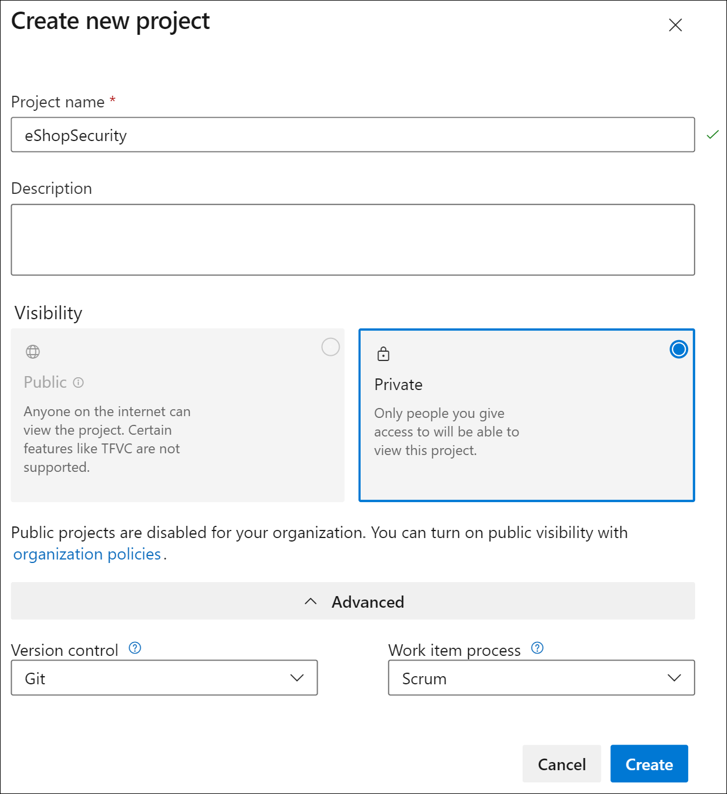
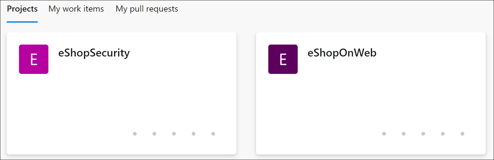
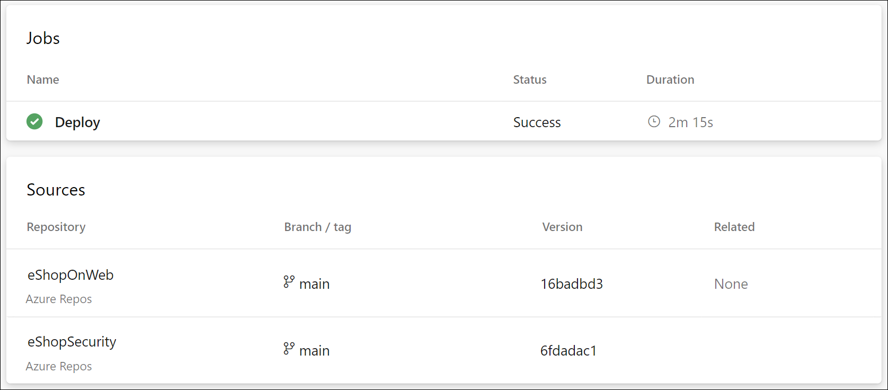

---
lab:
  title: Configurer une structure de projet et de référentiel pour prendre en charge les pipelines sécurisés
  module: 'Module 1: Configure a project and repository structure to support secure pipelines'
---

# Configurer une structure de projet et de référentiel pour prendre en charge les pipelines sécurisés

Dans ce labo, vous allez découvrir comment configurer une structure de projets et de dépôts dans Azure DevOps pour prendre en charge les pipelines sécurisés. Ce labo décrit les bonnes pratiques d’organisation des projets et des dépôts, l’attribution des autorisations et la gestion des fichiers sécurisés.

Ces exercices prennent environ **30** minutes.

## Avant de commencer

Vous aurez besoin d’un abonnement Azure, d’une organisation Azure DevOps et de l’application eShopOnWeb pour suivre les labos.

- Procédez comme suit pour [valider votre environnement de labo](APL2001_M00_Validate_Lab_Environment.md).

## Instructions

### Exercice 1 : Configurer une structure de projet sécurisée

Dans cet exercice, vous allez configurer une structure de projet sécurisée en créant un projet et en lui attribuant des autorisations de projet. La séparation des responsabilités et des ressources en différents projets ou référentiels avec des autorisations spécifiques prend en charge la sécurité.

#### Tâche 1 : Créer un projet d’équipe

1. Accédez au Portail Azure DevOps sur `https://dev.azure.com` et ouvrez votre organisation.

1. Ouvrez les **paramètres de votre organisation** en bas à gauche du portail, puis **Projets** sous la section Général.

1. Sélectionnez l’option **Nouveau projet** et utilisez les paramètres suivants :
   - nom : **eShopSecurity**
   - visibilité : **Privé**
   - avancé : Contrôle de version : **Git**
   - Avancé : Processus d’élément de travail : **Scrum**

    

1. Sélectionnez **Créer** pour créer le nouveau projet.

1. Vous pouvez maintenant basculer entre les différents projets d’équipe en cliquant sur l’icône Azure DevOps dans le coin supérieur gauche du Portail Azure DevOps.

    

Vous pouvez gérer les autorisations et les paramètres de chaque projet séparément en accédant au menu Paramètres du projet et en sélectionnant le projet d’équipe approprié. Si vous avez plusieurs utilisateurs ou équipes travaillant sur différents projets, vous pouvez également attribuer des autorisations à chaque projet séparément.

#### Tâche 2 : Créer un référentiel et attribuer des autorisations de projet

1. Sélectionnez le nom de l’organisation dans le coin supérieur gauche du Portail Azure DevOps, puis sélectionnez le nouveau projet **eShopSecurity** .

1. Sélectionnez le menu **Référentiels**.

1. Sélectionnez le bouton **Initialiser** pour initialiser le nouveau référentiel en ajoutant le fichier README.md.

1. Ouvrez le menu **Paramètres du projet** dans le coin inférieur gauche du portail et sélectionnez **Référentiels** sous la section Repos.

1. Sélectionnez le nouveau référentiel **eShopSecurity**, puis l’onglet **Sécurité**.

1. Supprimez les autorisations Hériter du parent en décochant le bouton à bascule **Héritage**.

1. Sélectionnez le groupe **Contributeurs** et sélectionnez la liste déroulante **Refuser** pour toutes les autorisations, à l’exception de **Lecture**. Cela empêche tous les utilisateurs du groupe Contributeurs d’accéder au référentiel.

1. Sélectionnez votre utilisateur sous Utilisateurs, puis le bouton **Autoriser** pour accepter toutes les autorisations.

    

1. (Facultatif) Ajoutez un groupe d’utilisateurs spécifique ou d’utilisateurs auxquels vous souhaitez accorder l’accès au référentiel et la possibilité d’exécuter des pipelines à partir du projet eShopOnWeb. Cliquez sur la zone de recherche, entrez le nom du groupe, sélectionnez-le, puis définissez les autorisations que vous souhaitez autoriser ou refuser pour le groupe ou l’utilisateur.

    > [!NOTE]
    > Vérifiez que vous disposez du même groupe dans votre projet eShopOnWeb. Cela vous permettra d’exécuter des pipelines à partir du projet eShopOnWeb et d’accéder au référentiel dans le projet eShopSecurity.

1. Vos modifications seront enregistrées automatiquement.

À présent, seul l’utilisateur auquel vous avez affecté des autorisations et les administrateurs peuvent accéder au référentiel. Cela est utile lorsque vous souhaitez autoriser des utilisateurs spécifiques à accéder au référentiel et à exécuter des pipelines à partir du projet eShopOnWeb.

### Exercice 2 : Configurer une structure de pipeline et de modèle pour prendre en charge des pipelines sécurisés

#### Tâche 1 : (à ignorer si vous l’avez déjà effectuée) Importer et exécuter le pipeline CI

1. Accédez au Portail Azure DevOps sur `https://dev.azure.com` et ouvrez votre organisation.

1. Ouvrez le projet **eShopOnWeb** dans Azure DevOps.

1. Accédez à **Pipelines > Pipelines**.

1. Sélectionnez le bouton **Créer un pipeline**.

1. Sélectionnez **Azure Repos Git (Yaml)**.

1. Sélectionnez le référentiel **eShopOnWeb** .

1. Sélectionnez **Fichier YAML Azure Pipelines existant**.

1. Sélectionnez le fichier **/.ado/eshoponweb-ci.yml**, puis **Continuer**.

1. Sélectionnez le bouton **Exécuter** pour exécuter le pipeline.

1. Votre pipeline choisira un nom en fonction du nom du projet. Renommez-le pour mieux identifier le pipeline.

1. Accédez à **Pipelines > Pipelines** et sélectionnez le pipeline récemment créé. Sélectionnez les points de suspension puis **Renommer/déplacer**.

1. Nommez-le **eshoponweb-ci**, puis sélectionnez **Enregistrer**.

#### Tâche 2 : Créer un principal de service et une connexion de service pour accéder aux ressources Azure.

Dans cette tâche, vous allez créer un principal de service à l’aide d’Azure CLI et une connexion de service dans Azure DevOps, ce qui vous permettra de déployer des ressources sur votre abonnement Azure.

1. Démarrez un navigateur web, accédez au Portail Azure sur `https://portal.azure.com` et connectez-vous avec le compte utilisateur qui a le rôle Propriétaire dans l’abonnement Azure que vous utiliserez dans ce labo et qui a le rôle Administrateur global dans le locataire Azure AD associé à cet abonnement.

1. Dans le Portail Azure, sélectionnez l’icône **Cloud Shell** située directement à droite de la zone de texte de recherche en haut de la page.

1. Si vous êtes invité à sélectionner **Bash** ou **PowerShell**, sélectionnez **Bash**.

   > [!NOTE]
   > Si c’est la première fois que vous démarrez **Cloud Shell** et que vous voyez le message **Vous n’avez aucun stockage monté**, sélectionnez l’abonnement que vous utilisez dans ce labo, puis sélectionnez **Créer un stockage**.

1. À partir de l’invite **Bash**, dans le volet **Cloud Shell**, exécutez les commandes suivantes pour récupérer les valeurs de l’ID d’abonnement Azure et des attributs de nom d’abonnement :

    ```bash
    az account show --query id --output tsv
    az account show --query name --output tsv
    ```

    > [!NOTE]
    > Copiez les deux valeurs dans un fichier texte. Vous en aurez besoin plus tard dans ce labo.

1. À partir de l’invite **Bash** dans le volet **Cloud Shell**, exécutez la commande suivante pour créer un principal de service :

    ```bash
    az ad sp create-for-rbac --name myServicePrincipalName \
                         --role contributor \
                         --scopes /subscriptions/mySubscriptionID
    ```

    > [!NOTE]
    > Remplacez **myServicePrincipalName** par n’importe quelle chaîne unique de caractères composés de lettres et de chiffres, par exemple **AzureDevOpsSP** et **mySubscriptionID** par votre id d’abonnement Azure.

    > [!NOTE]
    > La commande va générer une sortie JSON. Copiez la sortie dans un fichier texte. Vous en aurez besoin plus tard dans ce laboratoire.

1. Ensuite accédez au Portail Azure DevOps sur `https://dev.azure.com` et ouvrez votre organisation.

1. Ouvrez le projet **eShopOnWeb** , puis sélectionnez **Paramètres du projet** dans le coin inférieur gauche du portail.

1. Sous Pipelines, sélectionnez **Connexions de service**, puis le bouton **Créer une connexion de service**.

    

1. Dans le volet **Nouvelle connexion de service**, sélectionnez **Azure Resource Manager**, puis **Suivant** (Il peut être nécessaire de faire défiler l’écran vers le bas).

1. Ensuite, sélectionnez **Principal du service (manuel)** puis sélectionnez **Suivant**.

1. Remplissez les champs vides à l’aide des informations collectées lors des étapes précédentes :
    - ID et nom de l’abonnement.
    - ID du principal de service (ou clientId/AppId), clé du principal de service (ou mot de passe) et TenantId.
    - Dans **Nom de la connexion de service** tapez **azure subs**. Ce nom est référencé dans les pipelines YAML lorsque vous avez besoin d’une connexion de service Azure DevOps pour communiquer avec votre abonnement Azure.

        

1. Ne cochez pas **Accorder une autorisation d’accès à tous les pipelines**. Sélectionnez **Vérifier et enregistrer**.

    > [!NOTE]
    > L’autorisation **Accorder une autorisation d’accès à tous les pipelines** n’est pas recommandée pour les environnements de production. Elle est utilisée uniquement dans ce labo pour simplifier la configuration du pipeline.

#### Tâche 3 : (à ignorer si vous l’avez déjà effectuée) Importer et exécuter le pipeline CD

1. Accédez à **Pipelines > Pipelines**.

1. Sélectionnez le bouton **Nouveau pipeline**.

1. Sélectionnez **Azure Repos Git (Yaml)**.

1. Sélectionnez le référentiel **eShopOnWeb** .

1. Sélectionnez **Fichier YAML Azure Pipelines existant**.

1. Sélectionnez le fichier **/.ado/eshoponweb-cd-webapp-code.yml**, puis **Continuer**.

1. Dans la définition du pipeline YAML, sous la section des variables, personnalisez :
   - **AZ400-EWebShop-NAME** par le nom de votre préférence, par exemple **rg-eshoponweb-secure**.
   - **Emplacement** par le nom de la région Azure dans laquelle vous souhaitez déployer vos ressources, par exemple, **southcentralus**.
   - **YOUR-SUBSCRIPTION-ID** par votre ID d’abonnement Azure ;
   - **az400eshop-NAME** par un nom d’application web à déployer avec un nom unique global, par exemple, **eshoponweb-lab-secure** ;

1. Sélectionnez **Enregistrer et exécuter**, choisissez de valider directement dans la branche principale ou créez une branche.

1. Sélectionnez de nouveau **Enregistrer et exécuter**.

    > [!NOTE]
    > Si vous choisissez de créer une branche, vous devez créer une demande de tirage (pull request) pour fusionner les modifications apportées à la branche principale.

1. Ouvrez le pipeline. Si vous voyez le message « Ce pipeline a besoin d’une autorisation pour accéder à une ressource avant que cette exécution puisse poursuivre le déploiement vers l’application web », sélectionnez **Afficher**, **Autoriser** et à nouveau **Autoriser**. Cette opération est nécessaire pour permettre au pipeline de créer la ressource Azure App Service.

    

1. Le déploiement peut prendre quelques minutes, attendez que le pipeline s’exécute. La définition CD se compose des tâches suivantes :
      - **Ressources** : il est prêt à se déclencher automatiquement en fonction de l’achèvement du pipeline CI. Il télécharge également le référentiel pour le fichier bicep.
      - **AzureResourceManagerTemplateDeployment** : déploie l’application web Azure à l’aide du modèle bicep.
1. Votre pipeline choisira un nom en fonction du nom du projet. Renommons-le pour mieux identifier le pipeline.

1. Accédez à **Pipelines > Pipelines** et sélectionnez le pipeline récemment créé. Sélectionnez les points de suspension puis **Renommer/déplacer**.

1. Nommez-le **eshoponweb-cd-webapp-code**, puis sélectionnez **Enregistrer**.

Vous devez maintenant avoir deux pipelines en cours d’exécution dans votre projet eShopOnWeb.


#### Tâche 4 : Déplacer les variables de pipeline CD vers un modèle YAML

Dans cette tâche, vous allez créer un modèle YAML pour stocker les variables utilisées dans le pipeline CD. Cela vous permet de réutiliser le modèle dans d’autres pipelines.

1. Accédez à **Repos**, puis à **Fichiers**.

1. Développez le dossier **.ado** et sélectionnez **Nouveau fichier**.

1. Nommez le fichier **eshoponweb-secure-variables.yml**, puis sélectionnez **Créer**.

1. Ajoutez la section des variables utilisée dans le pipeline CD au nouveau fichier. Le fichier doit se présenter comme suit :

    ```YAML
    variables:
      resource-group: 'rg-eshoponweb-secure'
      location: 'southcentralus' #name of the Azure region you want to deploy your resources
      templateFile: '.azure/bicep/webapp.bicep'
      subscriptionid: 'YOUR-SUBSCRIPTION-ID'
      azureserviceconnection: 'YOUR-AZURE-SERVICE-CONNECTION-NAME'
      webappname: 'eshoponweb-lab-secure'

    ```

    > [!IMPORTANT]
    > Remplacez les valeurs des variables par les valeurs de votre environnement (groupe de ressources, emplacement, ID d’abonnement, connexion de service Azure et nom de l’application web).

1. Sélectionnez **Valider**, ajoutez un commentaire, puis sélectionnez le bouton **Valider**.

1. Ouvrez la définition du pipeline **eshoponweb-cd-webapp-code.yml** et remplacez la section des variables par les éléments suivants :

    ```YAML
    variables:
      - template: eshoponweb-secure-variables.yml
    ```

    > [!NOTE]
    > Si vous utilisez un autre chemin d’accès pour le fichier de modèle, vous devez mettre à jour le chemin d’accès dans la définition du pipeline.

1. Sélectionnez **Enregistrer** et **exécutez** à nouveau le pipeline.

Vous disposez maintenant d’un modèle YAML avec les variables utilisées dans le pipeline CD. Vous pouvez réutiliser ce modèle dans d’autres pipelines dans des scénarios où vous devez déployer les mêmes ressources. En outre, votre équipe des opérations peut contrôler le groupe de ressources et l’emplacement où les ressources sont déployées, ainsi que d’autres informations dans vos valeurs de modèle, et vous n’avez pas besoin d’apporter de modifications à votre définition de pipeline.

#### Tâche 5 : Déplacer les modèles YAML vers un référentiel et un projet distincts

Dans cette tâche, vous allez déplacer les modèles YAML vers un référentiel et un projet distincts.

1. Dans votre projet eShopSecurity, accédez à **Repos > Fichiers**.

1. Créez un fichier nommé **eshoponweb-secure-variables.yml**.

1. Copiez le contenu du fichier **.ado/eshoponweb-secure-variables.yml** depuis le référentiel eShopOnWeb vers le nouveau fichier.

1. Validez les modifications :

1. Ouvrez la définition de pipeline **eshoponweb-cd-webapp-code.yml** à partir du projet eShopOnWeb.

1. Ajouter ce qui suit à la section des ressources :

    ```YAML
    resources:
      repositories:
        - repository: eShopSecurity
          type: git
          name: eShopSecurity/eShopSecurity #name of the project and repository

    ```

1. Remplacez la section des variables par ce qui suit :

    ```YAML
    variables:
      - template: eshoponweb-secure-variables.yml@eShopSecurity #name of the template and repository
    ```

    

1. Sélectionnez **Enregistrer** et **exécutez** à nouveau le pipeline. Vous verrez que le pipeline utilise le modèle YAML à partir du référentiel eShopSecurity.

    

Vous disposez maintenant des modèles YAML dans un référentiel et un projet distincts. Vous pouvez réutiliser ces modèles dans d’autres pipelines dans des scénarios où vous devez déployer les mêmes ressources. En outre, votre équipe des opérations peut contrôler le groupe de ressources, l’emplacement, la sécurité et l’endroit où les ressources sont déployées, ainsi que d’autres informations dans vos valeurs de modèle, et vous n’avez pas besoin d’apporter de modifications à votre définition de pipeline.

### Exercice 2 : Effectuerle nettoyage des ressources Azure et Azure DevOps

Dans cet exercice, vous allez supprimer les ressources Azure et Azure DevOps créées dans ce labo.

#### Tâche 1 : Supprimer les ressources Azure

1. Dans le Portail Azure, ouvrez le groupe de ressources créé, puis sélectionnez **Supprimer le groupe de ressources** pour toutes les ressources créées dans ce labo.

    

    > [!WARNING]
    > N’oubliez pas de supprimer toutes les nouvelles ressources Azure que vous n’utilisez plus. La suppression des ressources inutilisées vous évitera d’encourir des frais inattendus.

#### Tâche 2 : Supprimer les pipelines Azure DevOps

1. Accédez au Portail Azure DevOps sur `https://dev.azure.com` et ouvrez votre organisation.

1. Ouvrez le projet **eShopOnWeb**.

1. Accédez à **Pipelines > Pipelines**.

1. Accédez à **Pipelines > Pipelines** et supprimez les pipelines existants.

## Révision

Dans ce labo, vous avez découvert la façon de configurer et d’organiser une structure de projet et de référentiel sécurisée dans Azure DevOps. En gérant efficacement les autorisations, vous pouvez vous assurer que les utilisateurs appropriés ont accès aux ressources dont ils ont besoin tout en maintenant la sécurité et l’intégrité de vos pipelines et processus DevOps.
