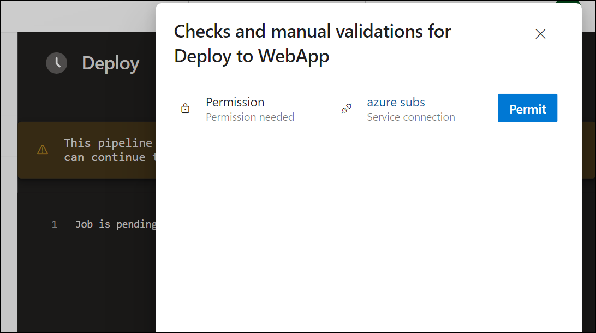
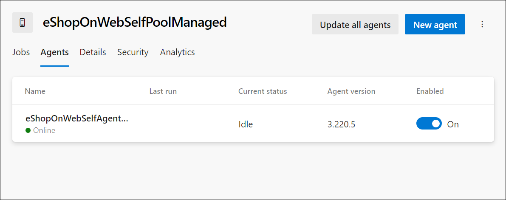

---
lab:
  title: Identité gérée pour les projets et les pipelines
  module: 'Module 2: Manage identity for projects, pipelines, and agents'
---

# Identité gérée pour les projets et les pipelines

Les identités managées offrent une méthode sécurisée pour contrôler l’accès aux ressources Azure. Azure gère automatiquement ces identités, ce qui vous permet de vérifier l’accès aux services compatibles avec l’authentification Azure AD. Vous n’avez donc pas besoin d’incorporer des informations d’identification dans votre code, ce qui améliore la sécurité. Dans Azure DevOps, les identités managées peuvent authentifier les ressources Azure au sein de vos agents auto-hébergés, ce qui simplifie le contrôle d’accès sans compromettre la sécurité.

Dans ce labo, vous allez créer une identité managée à utiliser dans vos pipelines YAML en utilisant Azure DevOps avec des agents auto-hébergés et une identité managée.

Ces exercices prennent environ **45** minutes.

## Avant de commencer

Vous aurez besoin d’un abonnement Azure, d’une organisation Azure DevOps et de l’application eShopOnWeb pour suivre les labos.

- Procédez comme suit pour [valider votre environnement de labo](APL2001_M00_Validate_Lab_Environment.md).

- Vérifier que vous disposez d’un compte Microsoft ou d’un compte Azure AD avec le rôle Propriétaire ou Contributeur dans l’abonnement Azure. Pour plus d’informations, consultez [Répertorier les attributions de rôle Azure à l’aide du portail Azure](https://learn.microsoft.com/azure/role-based-access-control/role-assignments-list-portal) et [Afficher et attribuer des rôles d’administrateur dans Azure Active Directory](https://learn.microsoft.com/azure/active-directory/roles/manage-roles-portal).

## Instructions

### Exercice 1 : Importer et exécuter des pipelines CI/CD

Dans cet exercice, vous allez importer et exécuter le pipeline CI, configurer la connexion de service avec votre abonnement Azure, puis importer et exécuter le pipeline CD.

#### Tâche 1 : (à ignorer si vous l’avez déjà effectuée) Importer et exécuter le pipeline CI

Commençons par importer le pipeline CI nommé [eshoponweb-ci.yml](https://github.com/MicrosoftLearning/eShopOnWeb/blob/main/.ado/eshoponweb-ci.yml).

1. Accédez au Portail Azure DevOps sur `https://dev.azure.com` et ouvrez votre organisation.

1. Ouvrez le projet **eShopOnWeb**.

1. Accédez à **Pipelines > Pipelines**.

1. Sélectionnez le bouton **Nouveau pipeline**.

1. Sélectionnez **Azure Repos Git (Yaml)**.

1. Sélectionnez le référentiel **eShopOnWeb** .

1. Sélectionnez **Fichier YAML Azure Pipelines existant**.

1. Sélectionnez le fichier **/.ado/eshoponweb-ci.yml**, puis cliquez sur **Continuer**.

1. Sélectionnez le bouton **Exécuter** pour exécuter le pipeline.

    > [!NOTE]
    > Votre pipeline choisira un nom en fonction du nom du projet. Renommez-le pour mieux identifier le pipeline.

1. Accédez à **Pipelines > Pipelines**, sélectionnez le pipeline récemment créé, sélectionnez les points de suspension, puis sélectionnez l’option **Renommer/déplacer**.

1. Nommez-le **eshoponweb-ci**, puis sélectionnez **Enregistrer**.

#### Tâche 2 : Gérer la connexion de service

Vous pouvez créer une connexion à partir d’Azure Pipelines vers des services externes et distants pour les tâches s’exécutant dans un travail.

Dans cette tâche, vous allez créer un principal de service à l’aide d’Azure CLI, ce qui permettra à Azure DevOps d’effectuer les actions suivantes :

- Déployer des ressources sur votre abonnement Azure
- Déployer l’application eShopOnWeb

> [!NOTE]
> Si vous disposez déjà d’un principal de service et d’une connexion de service à votre abonnement Azure nommé **azure subs**, vous pouvez passer directement à la tâche suivante.

Vous aurez besoin d’un principal de service pour déployer des ressources Azure à partir d’Azure Pipelines.

Un principal de service est créé automatiquement par Azure Pipelines lorsque vous vous connectez à un abonnement Azure à partir d’une définition de pipeline ou lorsque vous créez une connexion de service à partir de la page des paramètres du projet (option automatique). Vous pouvez également créer manuellement le principal de service à partir du portail ou à l’aide d’Azure CLI et le réutiliser dans les projets.

1. Démarrez un navigateur web, accédez au Portail Azure sur `https://portal.azure.com` et connectez-vous avec le compte utilisateur qui a le rôle Propriétaire dans l’abonnement Azure que vous utiliserez dans ce labo et qui a le rôle Administrateur global dans le locataire Azure AD associé à cet abonnement.

1. Dans le Portail Azure, sélectionnez l’icône **Cloud Shell** située directement à droite de la zone de texte de recherche en haut de la page.

1. Si vous êtes invité à sélectionner **Bash** ou **PowerShell**, sélectionnez **Bash**.

   > [!NOTE]
   > Si c’est la première fois que vous démarrez **Cloud Shell** et que vous voyez le message **Vous n’avez aucun stockage monté**, sélectionnez l’abonnement que vous utilisez dans ce labo, puis sélectionnez **Créer un stockage**.

1. À partir de l’invite **Bash**, dans le volet **Cloud Shell**, exécutez les commandes suivantes pour récupérer les valeurs de l’attribut d’ID d’abonnement Azure :

    ```sh
    subscriptionName=$(az account show --query name --output tsv)
    subscriptionId=$(az account show --query id --output tsv)
    echo $subscriptionName
    echo $subscriptionId
    ```

    > [!NOTE]
    > Copiez les deux valeurs dans un fichier texte. Vous en aurez besoin plus tard dans ce labo.

1. À partir de l’invite **Bash** dans le volet **Cloud Shell**, exécutez la commande suivante pour créer un principal de service :

    ```sh
    az ad sp create-for-rbac --name sp-eshoponweb-azdo --role contributor --scopes /subscriptions/$subscriptionId
    ```

    > [!NOTE]
    > La commande va générer une sortie JSON. Copiez la sortie dans un fichier texte. Vous en aurez besoin plus tard dans ce laboratoire.

1. Ensuite, accédez au projet Azure DevOps **eShopOnWeb**. Cliquez sur **Paramètres du projet > Connexions de service (sous Pipelines)** et **Nouvelle connexion de service**.

1. Dans le volet **Nouvelle connexion de service**, sélectionnez **Azure Resource Manager**, puis **Suivant** (Il peut être nécessaire de faire défiler l’écran vers le bas).

1. Ensuite, sélectionnez **Principal du service (manuel)** puis sélectionnez **Suivant**.

1. Remplissez les champs vides à l’aide des informations collectées lors des étapes précédentes :
    - ID et nom de l’abonnement.
    - ID du principal de service (ou clientId), clé (ou mot de passe) et TenantId.
    - Dans **Nom de la connexion de service** tapez **azure subs**. Ce nom est référencé dans les pipelines YAML lorsque vous avez besoin d’une connexion de service Azure DevOps pour communiquer avec votre abonnement Azure.

1. Sélectionnez **Vérifier et enregistrer**.

#### Tâche 3 : Importer et exécuter le pipeline CD

À présent, importez le pipeline CD nommé [eshoponweb-cd-webapp-code.yml](https://github.com/MicrosoftLearning/eShopOnWeb/blob/main/.ado/eshoponweb-cd-webapp-code.yml).

1. Accédez à **Pipelines > Pipelines**.

1. Cliquez sur le bouton **Nouveau pipeline**.

1. Sélectionnez **Azure Repos Git (Yaml)**.

1. Sélectionnez le référentiel **eShopOnWeb** .

1. Sélectionnez **Fichier YAML Azure Pipelines existant**.

1. Sélectionnez le fichier **/.ado/eshoponweb-cd-webapp-code.yml**, puis **Continuer**.

1. Dans la définition du pipeline YAML, définissez la section des variables pour effectuer les opérations suivantes :

    ```YAML
    variables:
      resource-group: 'AZ400-EWebShop-NAME'
      location: 'westeurope'
      templateFile: '.azure/bicep/webapp.bicep'
      subscriptionid: 'YOUR-SUBSCRIPTION-ID'
      azureserviceconnection: 'azure subs'
      webappname: 'az400-webapp-NAME'
    ```

1. Dans la section des variables, remplacez les espaces réservés par les valeurs suivantes :

   - **AZ400-EWebShop-NAME** par le nom de votre préférence, par exemple **rg-eshoponweb**.
   - **emplacement** par le nom de la région Azure dans laquelle vous souhaitez déployer vos ressources, par exemple, **southcentralus**.
   - **YOUR-SUBSCRIPTION-ID** par votre ID d’abonnement Azure ;
   - **az400-webapp-NAME** par un nom d’application web à déployer avec un nom unique global, par exemple, **eshoponweb-lab-YOURNAME** ;

1. Le cas échéant, dans la section des ressources, supprimez les entrées suivantes :

    ```YAML
    repositories:
      - repository: eShopSecurity
        type: git
        name: eShopSecurity/eShopSecurity #name of the project and repository
    ```

1. Sélectionnez **Enregistrer et exécuter**, choisissez de valider directement dans la branche principale ou créez une branche.

1. Sélectionnez de nouveau **Enregistrer et exécuter**.

    > [!NOTE]
    > Si vous choisissez de créer une branche, vous devez créer une demande de tirage (pull request) pour fusionner les modifications apportées à la branche principale.

1. Ouvrez le pipeline. Si vous voyez le message « Ce pipeline a besoin d’une autorisation pour accéder à une ressource avant que cette exécution puisse poursuivre le déploiement vers l’application web », sélectionnez **Afficher**, **Autoriser** et à nouveau **Autoriser**. Cette opération est nécessaire pour permettre au pipeline de créer la ressource Azure App Service.

    

1. Le déploiement peut prendre quelques minutes, attendez que le pipeline s’exécute. La définition CD se compose des tâches suivantes :
      - **Ressources** : il est prêt à se déclencher automatiquement en fonction de l’achèvement du pipeline CI. Il télécharge également le référentiel pour le fichier bicep.
      - **AzureResourceManagerTemplateDeployment** : déploie l’application web Azure à l’aide du modèle bicep.

1. Votre pipeline choisira un nom en fonction du nom du projet. **Renommons**-le pour mieux identifier le pipeline.

1. Accédez à **Pipelines > Pipelines**, sélectionnez le pipeline récemment créé, sélectionnez les points de suspension, puis sélectionnez l’option **Renommer/déplacer**.

1. Nommez-le **eshoponweb-cd-webapp-code**, puis sélectionnez **Enregistrer**.

### Exercice 2 : Créer une identité managée pour la connexion de service

Dans cet exercice, vous allez créer une identité managée, puis une connexion de service pour l’utiliser dans les pipelines CI/CD.

#### Tâche 1 : Créer une identité managée

1. Dans votre navigateur, ouvrez le portail Azure sur `https://portal.azure.com`.

1. Dans la zone **Rechercher des ressources, des services et des documents (G+/),** tapez **Identités managées** et sélectionnez-le dans la liste déroulante.

    

1. Sélectionnez le bouton **Créer une identité managée**.

1. Dans le volet **Créer une identité managée**, remplissez les informations requises :
   - **Abonnement** avec votre abonnement Azure.
   - **Groupe de ressources** avec un groupe de ressources existant ou nouveau.
   - **Région** avec la région proche de votre emplacement ou disponible pour vos ressources.
   - **Nom ** avec le nom de l’identité managée de votre préférence, par exemple **eshoponweb-mi**.

    

    > [!NOTE]
    > Si vous n’avez pas de groupe de ressources, vous pouvez en créer un en cliquant sur le lien **Créer**.

1. Sélectionnez le bouton **Vérifier + créer**, puis sélectionnez **Créer**.

#### Tâche 2 : Attribuer des autorisations à l’identité managée

Ensuite, vous devez affecter les autorisations de l’identité managée au groupe de ressources et aux services d’application.

1. Dans le Portail Azure, accédez à la nouvelle identité gérée que vous avez créée précédemment.

1. Sélectionnez l’onglet **Attributions de rôles Azure** dans le menu de gauche.

1. Sélectionnez le bouton **Ajouter une attribution de rôle** et effectuez les actions suivantes :

    | Setting | Action |
    | -- | -- |
    | Liste déroulante **Portée** | sélectionnez **Groupe de ressources**. |
    | Liste déroulante  **Abonnement** | Sélectionnez votre abonnement Azure. |
    | Liste déroulante **Groupe de ressources** | Sélectionnez le groupe de ressources existant. |
    | Liste déroulante **Rôle** | Sélectionnez le rôle **Contributeur**. |

1. Cliquez sur le bouton **Enregistrer**.

    

### Exercice 3 : Créer une machine virtuelle Azure à l’aide de l’agent auto-hébergé et de l’identité managée, puis mettre à jour le pipeline CI

Dans cet exercice, vous allez créer une machine virtuelle Azure à l’aide de l’agent auto-hébergé et de l’identité managée que vous avez créés dans l’exercice précédent. Ensuite, vous allez mettre à jour le pipeline CI pour utiliser la nouvelle machine virtuelle Azure.

#### Tâche 1 : Créer une machine virtuelle Azure

1. Dans votre navigateur, ouvrez le portail Azure sur `https://portal.azure.com`.

1. Dans la zone **Rechercher des ressources, des services et des documents (G+/),** tapez **Machine virtuelles** et sélectionnez-le dans la liste déroulante.

1. Cliquez sur le bouton **Créer**.

1. Sélectionnez la **machine virtuelle Azure avec une configuration prédéfinie**.

    

1. Sélectionnez **Dev/Test** comme environnement de charge de travail et **usage général** comme type de charge de travail.

1. Sélectionnez le bouton **Continuer pour créer une machine virtuelle** , sous l’onglet **De base**, effectuez les actions suivantes, puis sélectionnez l’onglet **Gestion** :

    | Setting | Action |
    | -- | -- |
    | Liste déroulante  **Abonnement** | Sélectionnez votre abonnement Azure. |
    | Section **Groupe de ressources** | Sélectionnez le groupe de ressources existant ou nouveau, par exemple, **eshoponweb-resource**. |
    | Zone de texte **Nom de la machine virtuelle**  | Entrez le nom de votre préférence, par exemple **eshoponweb-vm**. |
    | Liste déroulante **Région** | Sélectionnez la région proche de votre emplacement ou disponible pour vos ressources, par exemple, **USA Centre Sud**. |
    | Liste déroulante **Options de disponibilité** | Sélectionnez **Aucune redondance d’infrastructure requise**. |
    | Liste déroulante **Type de sécurité** | Sélectionnez avec l’option **Lancement fiable de machines virtuelles**. |
    | Liste déroulante **Image** | Sélectionnez l’image **Windows Server 2019 ou 2022 Datacenter**  |
    | Liste déroulante **Taille** | Sélectionnez la taille **Standard** la moins chère à des fins de test. |
    | Zone de texte **Nom d’utilisateur** | Entrez le nom d’utilisateur de votre préférence. |
    | Zone de texte **Mot de passe**. | Entrez le mot de passe de votre préférence. |
    | Section **Ports d’entrée publics** | Sélectionnez **Autoriser les ports sélectionnés**. |
    | Liste déroulante **Sélectionner les ports entrants** | Sélectionnez **RDP (3389)**. |

1. Sous l’onglet **Gestion**, effectuez les actions suivantes, puis sélectionnez **Vérifier + créer**:
   
    Section | **Activer l’identité managée affectée par le système** | **Case à cocher** Sélectionner. Cela permet à la machine virtuelle d’utiliser l’identité managée que vous avez créée. | | Section **Adresse IP publique** | Sélectionnez **Créer**, entrez un nom pour votre préférence, puis sélectionnez **Ok** |

    > [!IMPORTANT]
    > N’ignorez pas l’étape Exercice 5 : Supprimer les ressources du labo Azure pour éviter les frais inattendus.

1. Sous l’onglet **Review + create (Vérifier + créer)** , sélectionnez **Créer**.

1. Ouvrez les paramètres de la machine virtuelle, sélectionnez l’onglet **Identité** et sélectionnez le bouton **Attributions de rôles Azure**.

1. Cliquez sur le bouton **Ajouter une attribution de rôle**.

1. Sélectionnez l’étendue de l’abonnement, l’abonnement et le rôle **Contributeur**.

1. Cliquez sur le bouton **Enregistrer**.

#### Tâche 2 : Ouvrir la nouvelle machine virtuelle Azure et installer l’agent auto-hébergé

1. Ouvrez la nouvelle machine virtuelle Azure que vous avez créée précédemment à l’aide de la connexion RDP. Vous trouverez les informations de connexion dans la **vue d’ensemble**, en cochant le bouton **Connecter**.

2. À partir de la machine virtuelle Azure, procédez comme suit pour installer l’agent dans la nouvelle machine virtuelle Azure à partir de l’e[xercice 1 du labo Configurer des agents et des pools d’agents pour des pipelines sécurisés](APL2001_M03_L03_Configure_Agents_And_Agent_Pools_for_Secure_Pipelines.md). Lorsque vous suivez les instructions, tenez compte des modifications suivantes :

   - Nommez le pool d’agents **eShopOnWebSelfPoolManaged** (au lieu d’**eShopOnWebSelfPool**) dans Tâche 1, étape 5.
   - Nommez l’agent **eShopOnWebSelfAgentManaged** (au lieu d’**eShopOnWebSelfAgent**) dans Tâche 4, étape 3.
   - Sélectionnez **NT AUTHORITY\NETWORK SERVICE** comme compte pour exécuter le service pendant la configuration du compte utilisateur dans Tâche 4, étape 3.

3. Une fois l’agent installé, ouvrez votre pool d’agents dans le Portail Azure DevOps et vérifiez que le nouvel agent est disponible.

    

### Exercice 4 : Créer une connexion de service à l’aide de l’identité managée et mettre à jour le pipeline CD

Dans cet exercice, vous allez créer une connexion de service à l’aide de la méthode d’authentification d’identité managée. Ensuite, vous allez mettre à jour le pipeline CD pour utiliser la nouvelle connexion de service.

#### Tâche 1 : Créer une connexion de service

1. Accédez au Portail Azure DevOps sur `https://dev.azure.com` et ouvrez votre organisation.

1. Ouvrez le projet **eShopOnWeb** et accédez à **Paramètres du projet > Connexions de service**.

1. Sélectionnez le bouton **Nouvelle connexion de service**, puis **Azure Resource Manager**.

1. Comme **méthode d’authentification**, sélectionnez **Identité managée**.

1. Remplissez les champs vides à l’aide des informations collectées lors des étapes précédentes :
    - ID d’abonnement, nom et ID de locataire (ou clientId).
    - Dans **Nom de la connexion de service** tapez **azure subs managed**. Ce nom est référencé dans les pipelines YAML lorsque vous avez besoin d’une connexion de service Azure DevOps pour communiquer avec votre abonnement Azure.

1. Sélectionnez **Vérifier** et **Enregistrer**.

#### Tâche 2 : Mettre à jour le pipeline CD

1. Accédez au Portail Azure DevOps sur `https://dev.azure.com` et ouvrez votre organisation.

1. Ouvrez le projet **eShopOnWeb** et accédez à **Pipelines > Pipelines**.

1. Sélectionnez le pipeline **eshoponweb-cd-webapp-code**, puis sélectionnez **Modifier**.

1. Dans la section des variables, mettez à jour la variable **serviceConnection** avec le nom de la connexion de service que vous avez créée dans la tâche précédente, **azure subs managed**.

    ```YAML
          azureserviceconnection: 'azure subs managed'
    ```

1. Dans la sous-section **travaux** de la section **phases**, mettez à jour la valeur de la propriété **pool** pour référencer le pool d’agents auto-hébergé que vous avez créé dans l’exercice précédent, **eShopOnWebSelfPoolManaged**, afin qu’il ait le format suivant :

    ```YAML    
          jobs:
          - job: Deploy
            pool: eShopOnWebSelfPoolManaged
            steps:
            #download artifacts
            - download: eshoponweb-ci
    ```

1. Sélectionnez **Enregistrer **, choisissez de valider directement dans la branche principale ou créez une branche.

1. Sélectionnez **Enregistrer** à nouveau.

    > [!NOTE]
    > Si vous choisissez de créer une branche, vous devez créer une demande de tirage (pull request) pour fusionner les modifications apportées à la branche principale.

1. Sélectionnez **Exécuter** le pipeline, puis cliquez à nouveau sur **Exécuter**.

1. Ouvrez le pipeline. Si vous voyez le message « Ce pipeline a besoin d’une autorisation pour accéder à une ressource avant que cette exécution puisse poursuivre le déploiement vers l’application web », sélectionnez **Afficher**, **Autoriser** et à nouveau **Autoriser**. Cette opération est nécessaire pour permettre au pipeline de créer la ressource Azure App Service.

1. Le déploiement peut prendre quelques minutes, attendez que le pipeline s’exécute.

1. Vous devez voir depuis les journaux de pipeline que le pipeline utilise l’identité managée.

    

Une fois le pipeline terminé, vous pouvez accéder au Portail Azure et vérifier la nouvelle ressource App Service.

### Exercice 5 : Supprimer les ressources du labo Azure.

1. Dans le Portail Azure, ouvrez le groupe de ressources créé, puis sélectionnez **Supprimer le groupe de ressources** pour toutes les ressources créées dans ce labo.

    

    > [!WARNING]
    > N’oubliez pas de supprimer toutes les nouvelles ressources Azure que vous n’utilisez plus. La suppression des ressources inutilisées vous évitera d’encourir des frais inattendus.

## Révision

Dans ce labo, vous avez appris à activer la configuration de façon dynamique et à gérer les indicateurs de caractéristique.
