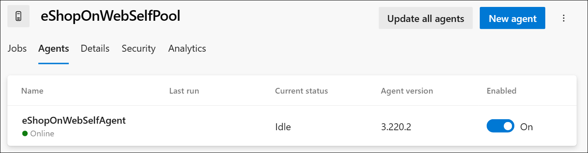

---
lab:
  title: Configurer des agents et des pools d’agents pour des pipelines sécurisés
  module: 'Module 3: Configure secure access to pipeline resources'
---

# Configurer des agents et des pools d’agents pour des pipelines sécurisés

Dans ce labo, vous allez découvrir comment configurer des agents et des pools d’agents Azure DevOps, et gérer les autorisations pour ces pools. Les pools d’agents Azure DevOps fournissent les ressources pour exécuter vos pipelines de build et de mise en production.

Ces exercices prennent environ **25** minutes.

## Avant de commencer

Vous aurez besoin d’un abonnement Azure, d’une organisation Azure DevOps et de l’application eShopOnWeb pour suivre les labos.

- Procédez comme suit pour [valider votre environnement de labo](APL2001_M00_Validate_Lab_Environment.md).
- Jeton PAT pour la configuration de l’agent.

## Instructions

Vous allez créer des agents et configurer des agents auto-hébergés à l’aide de Windows. Si vous souhaitez configurer des agents sur Linux ou MacOS, suivez les instructions de la documentation [Azure DevOps](https://docs.microsoft.com/azure/devops/pipelines/agents/v2-linux).

Pendant la configuration, gardez à l’esprit les éléments suivants :

- **Conservez des agents distincts pour chaque projet** : chaque agent ne peut être lié qu’à un seul pool. Si le partage des pools d’agents entre les projets permet d’enregistrer des économies sur les coûts d’infrastructure, il crée également un risque de mouvement latéral. Par conséquent, il est préférable d’avoir des pools d’agents distincts avec des agents dédiés pour chaque projet afin d’éviter la contamination croisée.
- **Utilisez des comptes à faible privilège pour exécuter des agents** : l’exécution d’un agent sous une identité disposant d’un accès direct aux ressources Azure DevOps peut poser des menaces pour la sécurité. L’exploitation de l’agent sous un compte local non privilégié tel que le service réseau est conseillé, ce qui réduit le risque.
- **Attention aux noms de groupes trompeurs** : le groupe « Comptes de service de collection de projets » dans Azure DevOps est un risque de sécurité potentiel. L’exécution d’agents à l’aide d’une identité qui fait partie de ce groupe et soutenue par Azure AD peut compromettre la sécurité de l’ensemble de votre organisation Azure DevOps.
- **Évitez les comptes à privilèges élevés pour les agents auto-hébergés** : l’utilisation de comptes à privilèges élevés pour exécuter des agents auto-hébergés, en particulier pour accéder aux secrets ou aux environnements de production, peut exposer votre système à de graves menaces si un pipeline est compromis.
- **Prioriser la sécurité** : pour protéger vos systèmes, utilisez le compte le moins privilégié afin d’exécuter des agents auto-hébergés. Par exemple, envisagez d’utiliser votre compte d’ordinateur ou une identité de service managé. Il est également conseillé d’autoriser Azure Pipelines à gérer l’accès aux secrets et aux environnements.

### Exercice 1 : Créer des agents et configurer des pools d’agents

Dans cet exercice, vous allez créer un agent et configurer des pools d’agents.

#### Tâche 1 : Créer un pool d’agents

1. Accédez au Portail Azure DevOps sur `https://dev.azure.com` et ouvrez votre organisation.

1. Ouvrez le projet **eShopOnWeb**, puis sélectionnez **Paramètres du projet** dans le menu inférieur gauche.

1. Dans **Pipelines > Pools d’agents**, sélectionnez le bouton **Ajouter un pool**.

1. Choisissez le type de pool **auto-hébergé**.

1. Donnez un nom au pool d’agents, tel que **eShopOnWebSelfPool**, et ajoutez une description facultative.

1. Laissez l’option **Accorder une autorisation d’accès à tous les pipelines** décochée.

    

1. Sélectionnez le bouton **Créer** pour créer le pool d’agents.

#### Tâche 2 : Créer un agent

1. Sélectionnez le pool d’agents nouvellement créé, puis sélectionnez l’onglet **Agents**.

1. Sélectionnez le bouton **Nouvel agent**, puis le bouton **Télécharger** à partir de **Télécharger l’agent** dans la nouvelle fenêtre contextuelle.

1. Suivez les instructions d’installation pour installer l’agent sur votre ordinateur depuis la fenêtre contextuelle.
   1. Exécutez les commandes suivantes à partir de PowerShell pour créer un dossier d’agent sur votre ordinateur.

        ```powershell
        mkdir agent ; cd agent        
        ```

        > [!NOTE]
        > Vérifiez que vous vous trouvez dans le dossier racine de votre profil utilisateur ou dans le dossier dans lequel vous souhaitez installer l’agent.

   2. Si vous choisissez le dossier **Télécharger** sur votre ordinateur, à partir de PowerShell, exécutez la commande suggérée :

        ```powershell
        Add-Type -AssemblyName System.IO.Compression.FileSystem ; [SysteIO.Compression.ZipFile]::ExtractToDirecto("$HOME\Downloads\vsts-agent-win-x64-3.220.2.zip", "$PWD")
        
        ```
        > [!NOTE]
        > Si vous avez téléchargé l’agent à un autre emplacement, remplacez le chemin dans la commande ci-dessus.

#### Tâche 3 : Créer un jeton PAT

Avant de configurer votre agent, créez un jeton PAT ou choisissez-en un existant. Procédez comme suit pour créer un environnement :

1. Accédez au Portail Azure DevOps sur `https://dev.azure.com` et ouvrez votre organisation.

1. Accédez au projet eShopOnWeb, puis sélectionnez **Paramètres utilisateur** dans le menu supérieur droit (à gauche de votre image de profil utilisateur).

1. Sélectionnez le menu **Jetons d’accès personnel**.

    

1. Sélectionnez le bouton **Nouveau jeton**.

1. Donnez un nom au jeton, tel que **eShopOnWebToken**.

1. Sélectionnez l’organisation Azure DevOps que vous souhaitez utiliser le jeton.

1. Définissez la date d’expiration du jeton (utilisée uniquement pour configurer l’agent).

1. Sélectionnez l’étendue définie personnalisée.

1. Sélectionnez cette option pour afficher toutes les étendues.

1. Sélectionnez l’étendue **Pools d’agents (Lecture et gestion)**.

1. Sélectionnez le bouton **Créer** pour créer le jeton.

1. Copiez la valeur du jeton et enregistrez-la en lieu sûr (vous ne pourrez pas la voir à nouveau. Vous ne pouvez régénérer que le jeton).

    

    > [!IMPORTANT]
    > Utilisez la dernière option de privilège, **Pools d’agents (Lecture et gestion)**, uniquement pour la configuration de l’agent. Vérifiez également que vous définissez la date d’expiration minimale du jeton s’il s’agit du seul objectif de ce dernier. Vous pouvez créer un jeton avec les mêmes privilèges si vous devez configurer à nouveau l’agent.

#### Tâche 4 : Configurer l’agent

1. Ouvrez une nouvelle fenêtre PowerShell et accédez au dossier de l’agent que vous avez créé à l’étape précédente.

1. Exécutez la commande suivante pour configurer votre agent :

    ```powershell
    .\config.cmd
    ```

    > [!NOTE]
    > Si vous le souhaitez, exécutez l’agent de manière interactive en exécutant .\run.cmd. Vous ne pouvez pas fermer la fenêtre d’invite de commandes lors de l’exécution interactive.

1. Quand vous y êtes invité, entrez les informations suivantes pour configurer l’agent :
    - Entrez l’URL de l’organisation Azure DevOps : `https://dev.azure.com/`{nom de votre organisation}.
    - Choisissez le type d’authentification : **PAT**.
    - Entrez la valeur du jeton PAT que vous avez créé à l’étape précédente.
    - Entrez le nom du pool d’agents **eShopOnWebSelfPool** que vous avez créé à l’étape précédente.
    - Entrez le nom de l’agent **eShopOnWebSelfAgent**.
    - Choisissez le dossier de travail de l’agent (la valeur par défaut est _work).
    - Choisissez le mode d’exécution de l’agent (Y pour exécuter en tant que service).
    - Entrez Y pour activer SERVICE_SID_TYPE_UNRESTRICTED pour le service d’agent (Windows uniquement).
    - Entrez le compte d’utilisateur à utiliser pour le service.

        > [!IMPORTANT]
        > Pour exécuter le service d’agent, évitez d’utiliser des comptes à privilèges élevés. Au lieu de cela, utilisez un compte à privilèges faibles qui contient les autorisations minimales nécessaires à l’opération du service. Cette approche permet de maintenir un environnement sécurisé et stable.

    - Indiquez si vous souhaitez empêcher le démarrage du service immédiatement après la fin de la configuration (N pour démarrer le service).

        

    - Vérifiez l’état de l’agent en accédant au pool d’agents et en cliquant sur l’onglet **Agents**. Vous devez voir le nouvel agent dans la liste.

        

Pour plus d’informations sur les agents Windows, consultez : [Agents Windows auto-hébergés](https://learn.microsoft.com/azure/devops/pipelines/agents/windows-agent).

### Exercice 2 : Créer et configurer un groupe de sécurité pour le pool d’agents

Dans cet exercice, vous allez créer un groupe de sécurité pour le pool d’agents.

#### Tâche 1 : Créer un groupe de sécurité

1. Accédez au Portail Azure DevOps sur `https://dev.azure.com` et ouvrez votre organisation.

1. Ouvrez le projet **eShopOnWeb**, puis sélectionnez **Paramètres du projet** dans le menu inférieur gauche.

1. Ouvrez Autorisations sous Général.

1. Sélectionnez le bouton **Nouveau groupe**.

1. Donnez un nom au groupe, tel que **Groupe de sécurité eShopOnWeb**.

1. Ajoutez les utilisateurs que vous souhaitez voir faire partie du groupe.

1. Sélectionnez le bouton **Créer** pour créer le groupe.

    

#### Tâche 2 : Configurer le groupe de sécurité

1. Sélectionnez le nouveau groupe pour afficher son onglet **Autorisations**.

1. Refusez les autorisations inutiles pour le groupe, telles que **Renommer le projet d’équipe**, **Supprimer définitivement les éléments de travail** ou toute autre autorisation que vous ne souhaitez pas que le groupe possède, car elle est utilisée uniquement pour le pool d’agents.

    

    > [!IMPORTANT]
    > Si vous laissez les autorisations que vous ne souhaitez pas que le groupe possède, les scripts ou les tâches qui s’exécutent sur l’agent peuvent utiliser les autorisations de groupe pour réaliser des actions que vous ne souhaitez pas effectuer.

### Exercice 3 : Gérer les autorisations du pool d’agents

Dans cet exercice, vous allez gérer les autorisations pour le pool d’agents.

1. Accédez au Portail Azure DevOps sur `https://dev.azure.com` et ouvrez votre organisation.

1. Ouvrez le projet **eShopOnWeb**, puis sélectionnez **Paramètres du projet** dans le menu inférieur gauche.

1. Sélectionnez **Pipelines**, puis **Pools d’agents**.

1. Sélectionnez le pool d’agents **eShopOnWebSelfPool**.

1. Dans la vue des détails du pool d’agents, sélectionnez l’onglet **Sécurité**.

1. Sélectionnez le bouton **Ajouter** et ajoutez le nouveau groupe **Groupe de sécurité eShopOnWeb Security** aux autorisations utilisateur du pool d’agents.

1. Choisissez le rôle approprié pour l’utilisateur ou le groupe, tel que Lecteur du pool d’agents, Utilisateur ou Administrateur. Dans ce cas, choisissez **Utilisateur**.

1. Sélectionnez Ajouter pour appliquer les autorisations.

    

Vous êtes maintenant prêt à utiliser le pool d’agents dans vos pipelines en toute sécurité. Pour plus d’informations sur les pools d’agents, consultez : [Pools d’agents](https://learn.microsoft.com/azure/devops/pipelines/agents/pools-queues).

### Exercice 4 : Supprimer les ressources utilisées dans le labo

1. Arrêtez et supprimez le service d’agent en exécutant `.config.cmd remove`.

1. Supprimez le pool d’agents.

1. Supprimez le groupe de sécurité.

1. Révoquez le jeton PAT.

## Révision

Dans ce labo, vous avez découvert la façon de configurer un agent auto-hébergé et des pools d’agents Azure DevOps, et de gérer les autorisations pour ces pools. En gérant efficacement les autorisations, vous pouvez vous assurer que les utilisateurs appropriés ont accès aux ressources dont ils ont besoin tout en maintenant la sécurité et l’intégrité de vos processus DevOps.
