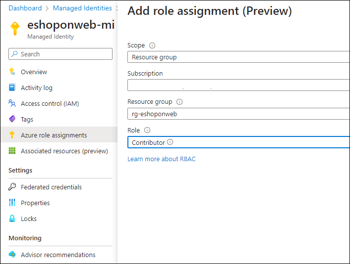

---
lab:
  title: Identité gérée pour les projets et les pipelines
  module: 'Module 3: Manage identity for projects, pipelines, and agents'
---

# Identité gérée pour les projets et les pipelines

Les identités managées offrent une méthode sécurisée pour contrôler l’accès aux ressources Azure. Azure gère automatiquement ces identités, ce qui vous permet de vérifier l’accès aux services compatibles avec l’authentification Azure AD. Vous n’avez donc pas besoin d’incorporer des informations d’identification dans votre code, ce qui améliore la sécurité. Dans Azure DevOps, les identités managées peuvent authentifier les ressources Azure au sein de vos agents auto-hébergés, ce qui simplifie le contrôle d’accès sans compromettre la sécurité.

Dans ce labo, vous allez créer une identité managée et l’utiliser dans des pipelines YAML Azure DevOps exécutés sur des agents auto-hébergés pour déployer des ressources Azure.

Le labo prend environ **30** minutes.

## Avant de commencer

Vous aurez besoin d’un abonnement Azure, d’une organisation Azure DevOps et de l’application eShopOnWeb pour suivre les labos.

- Vérifiez que vous disposez d'un compte Microsoft ou d'un compte Microsoft Entra avec le rôle Contributeur ou Propriétaire dans l'abonnement Azure. Pour plus d’informations, consultez [Répertorier les attributions de rôle Azure à l’aide du portail Azure](https://learn.microsoft.com/azure/role-based-access-control/role-assignments-list-portal) et [Afficher et attribuer des rôles d’administrateur dans Azure Active Directory](https://learn.microsoft.com/azure/active-directory/roles/manage-roles-portal).

## Prérequis

Effectuez les labos :

- Procédez comme suit pour [valider votre environnement de labo](APL2001_M00_Validate_Lab_Environment.md).
- [Configurer une structure de projet et de référentiel pour prendre en charge les pipelines sécurisés](APL2001_M01_L01_Configure_a_Project_and_Repository_Structure_to_Support_Secure_Pipelines.md)
- [Configurer des agents et des pools d’agents pour des pipelines sécurisés](APL2001_M02_L02_Configure_Agents_And_Agent_Pools_for_Secure_Pipelines.md)

## Instructions

### Exercice 0 : (ignorer si déjà effectué) importer et exécuter des pipelines CI/CD

Dans cet exercice, vous allez importer et exécuter des pipelines CI/CD dans le projet Azure DevOps.

#### Tâche 1 : (ignorer si déjà effectuée) importer et exécuter le pipeline CI

Commençons par importer le pipeline CI nommé [eshoponweb-ci.yml](https://github.com/MicrosoftLearning/eShopOnWeb/blob/main/.ado/eshoponweb-ci.yml).

1. Accédez au Portail Azure DevOps sur `https://aex.dev.azure.com` et ouvrez votre organisation.

1. Ouvrez le projet **eShopOnWeb** dans Azure DevOps.

1. Accédez à **Pipelines > Pipelines**.

1. Sélectionnez le bouton **Créer un pipeline**.

1. Sélectionnez **Azure Repos Git (Yaml)**.

1. Sélectionnez le référentiel **eShopOnWeb**.

1. Sélectionnez **Fichier YAML Azure Pipelines existant**.

1. Sélectionnez le fichier **/.ado/eshoponweb-ci.yml**, puis cliquez sur **Continuer**.

1. Sélectionnez le bouton **Exécuter** pour exécuter le pipeline.

   > **Remarque** : votre pipeline est nommé en fonction du nom du projet. Vous le renommez pour identifier plus facilement le pipeline.

1. Accédez à **Pipelines > Pipelines** et sélectionnez le pipeline récemment créé. Sélectionnez les points de suspension puis **Renommer/déplacer**.

1. Nommez-le **eshoponweb-ci**, puis sélectionnez **Enregistrer**.

#### Tâche 2 : (ignorer si déjà effectuée) importer et exécuter le pipeline CD

> **Remarque** : dans cette tâche, vous allez importer et exécuter le pipeline CD appelé [eshoponweb-cd-webapp-code.yml](https://github.com/MicrosoftLearning/eShopOnWeb/blob/main/.ado/eshoponweb-cd-webapp-code.yml).

1. Accédez à **Pipelines > Pipelines**.

1. Sélectionnez le bouton **Nouveau pipeline**.

1. Sélectionnez **Azure Repos Git (Yaml)**.

1. Sélectionnez le référentiel **eShopOnWeb**.

1. Sélectionnez **Fichier YAML Azure Pipelines existant**.

1. Sélectionnez le fichier **/.ado/eshoponweb-cd-webapp-code.yml**, puis **Continuer**.

1. Dans la définition du pipeline YAML, définissez la section des variables pour effectuer les opérations suivantes :

   ```yaml
   variables:
     resource-group: 'YOUR-RESOURCE-GROUP-NAME'
     location: 'centralus'
     templateFile: 'infra/webapp.bicep'
     subscriptionid: 'YOUR-SUBSCRIPTION-ID'
     azureserviceconnection: 'YOUR-AZURE-SERVICE-CONNECTION-NAME'
     webappname: 'YOUR-WEB-APP-NAME'
   ```

1. Remplacez les valeurs des variables par les valeurs de votre environnement :

   - Remplacez **YOUR-RESOURCE-GROUP-NAME** par le nom du groupe de ressources que vous souhaitez utiliser dans ce labo, par exemple, **rg-eshoponweb-secure**.
   - Définissez la valeur de la variable d’**emplacement** sur le nom de la région Azure dans laquelle vous souhaitez déployer vos ressources, par exemple, **centralus**.
   - Remplacez **YOUR-SUBSCRIPTION-ID** par votre ID d’abonnement Azure.
   - Remplacez **YOUR-AZURE-SERVICE-CONNECTION-NAME** par **azure subs**.
   - Remplacez **YOUR-WEB-APP-NAME** par un nom unique au monde de l’application web à déployer, par exemple, la chaîne **eshoponweb-lab-multi-123456** suivie d’un nombre aléatoire à six chiffres.

1. Sélectionnez **Enregistrer et Exécuter**, puis choisissez de valider directement dans la branche primaire.

1. Sélectionnez de nouveau **Enregistrer et exécuter**.

1. Ouvrez l’exécution de pipeline. Si vous voyez le message « Ce pipeline a besoin d’une autorisation pour accéder à une ressource avant que cette exécution puisse poursuivre le déploiement vers l’application web », sélectionnez **Afficher**, **Autoriser** et à nouveau **Autoriser**. Cette opération est nécessaire pour permettre au pipeline de créer la ressource Azure App Service.

   

1. Le déploiement peut prendre quelques minutes, attendez que le pipeline s’exécute. Le pipeline est déclenché après l’achèvement du pipeline CI et comprend les tâches suivantes :

   - **AzureResourceManagerTemplateDeployment** : Déploie l’application web Azure App Service à partir d’un modèle bicep.
   - **AzureRmWebAppDeployment** : Publie le site web sur l’application web Azure App Service.

   > **Remarque** : si le déploiement échoue, accédez à la page d’exécution du pipeline et sélectionnez **Réexécuter les travaux ayant échoué** pour appeler une autre exécution de pipeline.

   > **Remarque** : votre pipeline est nommé en fonction du nom du projet. **Renommons**-le pour mieux identifier le pipeline.

1. Accédez à **Pipelines > Pipelines** et sélectionnez le pipeline récemment créé. Sélectionnez les points de suspension puis **Renommer/déplacer**.

1. Nommez-le **eshoponweb-cd-webapp-code**, puis cliquez sur **Enregistrer**.

### Exercice 1 : configurer une identité managée dans Azure Pipelines

Dans cet exercice, vous allez utiliser une identité managée pour configurer une nouvelle connexion de service et l’incorporer dans les pipelines CI/CD.

#### Tâche 1 : définir l’identité managée dans l’abonnement Azure

1. Dans votre navigateur, ouvrez le portail Azure sur `https://portal.azure.com`.

1. Dans le portail Azure, accédez à la page affichant la machine virtuelle Azure **eshoponweb-vm** que vous avez déployée dans le [labo précédent](APL2001_M02_L02_Configure_Agents_And_Agent_Pools_for_Secure_Pipelines.md).

1. Dans la page de la machine virtuelle Azure **eshoponweb-vm**, dans la barre d’outils, sélectionnez **Démarrer** pour la démarrer, au cas où elle serait arrêtée.

1. Dans la page de la machine virtuelle Azure **eshoponweb-vm**, dans le menu vertical situé à gauche, dans la section **Sécurité**, sélectionnez **Identité**.

1. Dans la page **Identité**, vérifiez que l’**état** est sur **Activé** et sélectionnez **Attributions des rôles Azure**.

1. Sélectionnez le bouton **Ajouter une attribution de rôle** et effectuez les actions suivantes :

   | Setting | Action |
   | -- | -- |
   | Liste déroulante **Portée** | Sélectionnez **Abonnement**. |
   | Liste déroulante  **Abonnement** | Sélectionnez votre abonnement Azure. |
   | Liste déroulante **Rôle** | Sélectionnez le rôle **Contributeur**. |

   > **Remarque** : l’étendue de abonnement est nécessaire pour prendre en charge les déploiements dans les labos suivants.

1. Cliquez sur le bouton **Enregistrer**.

    

#### Tâche 2 : Créer une connexion de service basée sur l’identité managée

1. Basculez vers le navigateur web affichant le projet **eShopOnWeb** dans le portail Azure DevOps sur `https://aex.dev.azure.com`.

1. Dans le projet **eShopOnWeb**, accédez à **Paramètres du projet > Connexions de service**.

1. Sélectionnez le bouton **Nouvelle connexion de service**, puis **Azure Resource Manager**.

1. Comme **méthode d’authentification**, sélectionnez **Identité managée**.

1. Définissez le niveau d’étendue sur **Abonnement** et fournissez les informations du portail Azure, y compris l’**ID d’abonnement**, le **nom de l’abonnement** et l’**ID de locataire**.

   > **Remarque** : vous trouverez l’**ID d’abonnement** dans le portail Azure en accédant au panneau **Abonnements** et en sélectionnant l’abonnement que vous utilisez. L’**ID de locataire** se trouve dans le panneau **Microsoft Entra ID**.

1. Dans **Nom de la connexion de service** tapez **azure subs managed**. Ce nom est référencé dans les pipelines YAML lors de l’accès à votre abonnement Azure.

1. Cliquez sur **Enregistrer**.

#### Tâche 3 : mettre à jour le pipeline CI pour utiliser le pool d’agents autohébergés

Dans cette tâche, vous allez mettre à jour le pipeline CI pour utiliser le pool d’agents autohébergés.

1. Basculez vers la fenêtre de navigateur affichant le projet **eShopOnWeb** dans le portail Azure DevOps.

1. Dans la page du projet **eShopOnWeb**, accédez à **Pipelines > Pipelines**.

1. Sélectionnez le pipeline **eshoponweb-ci**, puis sélectionnez **Modifier**.

1. Dans la sous-section **travaux** de la section **étapes**, mettez à jour la valeur de la propriété **pool** pour référencer le pool d’agents auto-hébergé **eShopOnWebSelfPool** que vous avez configuré dans cette tâche, afin qu’il ait le format suivant :

   ```yaml
     jobs:
     - job: Build
       pool: eShopOnWebSelfPool
       steps:
       - task: DotNetCoreCLI@2
   ```

1. Sélectionnez **Valider et exécuter**, puis choisissez de valider directement dans la branche primaire.

1. Sélectionnez **Enregistrer** à nouveau.

1. Sélectionnez **Exécuter** le pipeline, puis cliquez à nouveau sur **Exécuter**.

1. Vérifiez que le travail de génération s’exécute sur l’agent **eShopOnWebSelfAgent** et qu’il s’exécute correctement.

    > **Remarque** : si vous voyez le message **La demande de l’agent n’est pas en cours d’exécution, car tous les agents potentiels exécutent d’autres requêtes. Position actuelle dans la file d’attente : 1**, vous pouvez attendre que l’agent devienne disponible ou vous pouvez arrêter le travail de l’agent en cours d’exécution. Il peut s’agir du pipeline CD qui s’exécute automatiquement.

    > **Remarque** : si vous voyez le message « Ce pipeline a besoin d’une autorisation pour accéder à une ressource avant que cette exécution puisse continuer à générer la solution .Net Core », dans la page d’exécution du pipeline, sélectionnez **Afficher**, **Autoriser** et à nouveau **Autoriser**. Cela est nécessaire pour permettre au pipeline d’utiliser le pool d’agents autohébergés.

#### Tâche 4 : mettre à jour le pipeline CD pour utiliser le pool d’agents autohébergés et la connexion de service basée sur l’identité managée

Dans cette tâche, vous allez mettre à jour le pipeline CD pour utiliser la connexion de service basée sur l’identité managée et le pool d’agents autohébergés.

1. Basculez vers la fenêtre de navigateur affichant le projet **eShopSecurity** dans le portail Azure DevOps.

   > **Remarque** : **eShopSecurity** est le nom du projet que vous avez créé dans le [premier labo](APL2001_M01_L01_Configure_a_Project_and_Repository_Structure_to_Support_Secure_Pipelines.md).

1. Dans la page du projet **eShopSecurity**, accédez à **Repos > Fichiers**.

1. Sélectionnez le fichier **eshoponweb-secure-variables.yml**, puis cliquez sur le bouton **Modifier**.

1. Dans la section des variables, mettez à jour la variable **azureserviceconnection** pour utiliser le nom de la connexion de service que vous avez créée dans la tâche précédente, **azure subs managed**.

   ```yaml
     azureserviceconnection: 'azure subs managed'
   ```

1. Cliquez sur le bouton **Valider**, puis choisissez de valider directement dans la branche primaire.

1. Cliquez à nouveau sur le bouton **Valider**.

1. Basculez vers le projet **eShopOnWeb**.

1. Dans la page du projet **eShopOnWeb**, accédez à **Pipelines > Pipelines**.

1. Sélectionnez le pipeline **eshoponweb-cd-webapp-code**, puis sélectionnez **Modifier**.

1. Dans la sous-section **travaux**de la section **phases**, mettez à jour la valeur de la propriété **pool** pour référencer le pool d’agents auto-hébergé que vous avez créé dans le labo précédent, **eShopOnWebSelfPool** afin de lui donner le format suivant :

   ```yaml
     jobs:
     - job: Deploy
       pool: eShopOnWebSelfPool
       steps:
       #download artifacts
       - download: eshoponweb-ci
   ```

1. Cliquez sur le bouton **Valider et enregistrer**, puis choisissez de valider directement dans la branche primaire.

1. Cliquez à nouveau sur **Enregistrer**.

1. Accédez à **Pipelines > Pipelines** et sélectionnez le pipeline **eshoponweb-cd-webapp-code** déjà en cours d’exécution depuis la tâche précédente.

1. Cliquez sur l’exécution de pipeline, puis sur **Annuler**. Cliquez sur le bouton **Oui** pour confirmer.

   > **Remarque** : vous allez exécuter le pipeline Activer les diagnostics du système pour afficher les journaux du pipeline.

1. Cliquez sur **Exécuter un nouveau pipeline**, cochez la case « Activer les diagnostics système », puis cliquez sur le bouton **Exécuter**.

1. Ouvrez l’exécution de pipeline.

   > **Remarque** : si vous voyez le message « Ce pipeline a besoin d’une autorisation pour accéder à 2 ressources avant que cette exécution puisse poursuivre le déploiement vers l’application web », sélectionnez **Afficher**, **Autoriser** et à nouveau **Autoriser**. Cela est nécessaire pour permettre au pipeline d’utiliser la connexion de service et le pool d’agents autohébergés.

1. Le déploiement peut prendre quelques minutes, attendez que le pipeline s’exécute.

   > [!IMPORTANT]
   > Si le pipeline échoue en raison de l’erreur AZ CLI, vous devrez peut-être redémarrer votre agent autohébergé et réexécuter le pipeline.
   > Pour redémarrer l’agent, dans le portail Azure, accédez à la page affichant la machine virtuelle Azure **eshoponweb-vm** que vous avez déployée dans le labo précédent, connectez-vous à la machine virtuelle à l’aide du bouton **Se connecter** et redémarrez le nom du service de l’agent Azure Pipelines à partir de vstsagent. Cliquez avec le bouton droit sur le service de l’agent et sélectionnez **Redémarrer**.

1. Vous devriez voir dans les journaux de pipeline que le pipeline utilise l’identité managée.

   

   > **Remarque** : une fois le pipeline terminé, vous pouvez utiliser le portail Azure pour vérifier l’état des ressources de l’application web App Service.

   > [!IMPORTANT]
   > N’oubliez pas de supprimer les ressources créées dans le portail Azure pour éviter les frais inutiles.

## Révision

Dans ce labo, vous avez appris à utiliser une identité managée affectée à des agents auto-hébergés dans des pipelines YAML Azure DevOps.
