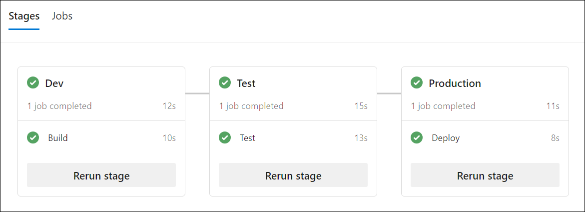

---
lab:
  title: Étendre un pipeline pour utiliser plusieurs modèles
  module: 'Module 5: Extend a pipeline to use multiple templates'
---

# Étendre un pipeline pour utiliser plusieurs modèles

Dans ce module, découvrez pourquoi il est important d’étendre un pipeline à plusieurs modèles et comment le faire avec Azure DevOps. Ce labo couvre les concepts fondamentaux et les bonnes pratiques pour créer un pipeline multiphase, un modèle de variables, un modèle de travail et un modèle de phase.

Ces exercices prennent environ **20** minutes.

## Avant de commencer

Vous aurez besoin d’un abonnement Azure, d’une organisation Azure DevOps et de l’application eShopOnWeb pour suivre les labos.

- Procédez comme suit pour [valider votre environnement de labo](APL2001_M00_Validate_Lab_Environment.md).

## Instructions

### Exercice 1 : Créer un pipeline YAML multiphase

#### Tâche 1 : Créer un pipeline YAML principal multiphase

1. Accédez au Portail Azure DevOps sur `https://dev.azure.com` et ouvrez votre organisation.

1. Ouvrez le projet **eShopOnWeb**.

1. Accédez à **Pipelines > Pipelines**.

1. Sélectionnez le bouton **Nouveau pipeline**.

1. Sélectionnez **Azure Repos Git (Yaml)**.

1. Sélectionnez le référentiel **eShopOnWeb** .

1. Sélectionnez **Pipeline de démarrage**.

1. Remplacez le contenu du fichier **azure-pipelines.yml** par le code suivant :

    ```YAML
    trigger:
    - main

    pool:
      vmImage: 'windows-latest'

    stages:
    - stage: Dev
      jobs:
      - job: Build
        steps:
        - script: echo Build
    - stage: Test
      jobs:
      - job: Test
        steps:
        - script: echo Test
    - stage: Production
      jobs:
      - job: Deploy
        steps:
        - script: echo Deploy

    ```

1. Sélectionnez **Enregistrer et exécuter**. Choisissez si vous souhaitez valider directement dans la branche principale ou créer une branche. Sélectionnez le bouton **Enregistrer et exécuter**.

   > [!NOTE]
   > Si vous choisissez de créer une branche, vous devez créer une demande de tirage (pull request) pour fusionner les modifications apportées à la branche principale.

1. Vous verrez le pipeline s’exécutant avec les trois phases (Dev, Test et Production) et les travaux correspondants. Attendez que le pipeline se termine et revienne à la page **Pipelines**.

    

1. Sélectionnez **...** (Autres options) sur le côté droit du pipeline que vous venez de créer, puis sélectionnez **Renommer/déplacer**.

1. Renommez le pipeline **eShopOnWeb-MultiStage-Main**, puis sélectionnez **Enregistrer**.

#### Tâche 2 : Créer un modèle de variables

1. Accédez à **Repos > Fichiers**.

1. Développez le dossier **.ado** et cliquez sur **Nouveau fichier**.

1. Nommez le fichier **eshoponweb-variables.yml**, puis cliquez sur **Créer**.

1. Ajoutez le code suivant au fichier :

    ```YAML
    variables:
      resource-group: 'YOUR-RESOURCE-GROUP-NAME'
      location: 'southcentralus' #name of the Azure region you want to deploy your resources
      templateFile: '.azure/bicep/webapp.bicep'
      subscriptionid: 'YOUR-SUBSCRIPTION-ID'
      azureserviceconnection: 'YOUR-AZURE-SERVICE-CONNECTION-NAME'
      webappname: 'YOUR-WEB-APP-NAME'

    ```

    > [!IMPORTANT]
    > Remplacez les valeurs des variables par les valeurs de votre environnement (groupe de ressources, emplacement, ID d’abonnement, connexion de service Azure et nom de l’application web).

1. Sélectionnez **Valider**, ajoutez un commentaire, puis sélectionnez le bouton **Valider**.

#### Tâche 3 : Préparer le pipeline pour utiliser des modèles

1. Accédez à **Pipelines > Pipelines**.

1. Ouvrez le pipeline **eShopOnWeb-MultiStage-Main**.

1. Sélectionnez **Modifier**.

1. Remplacez le contenu du fichier **azure-pipelines.yml** par le code suivant :

    ```YAML
    trigger:
    - main
    variables:
    - template: .ado/eshoponweb-variables.yml
    
    stages:
    - stage: Dev
      jobs:
      - template: .ado/eshoponweb-ci.yml
    - stage: Test
      jobs:
      - template: .ado/eshoponweb-cd-webapp-code.yml
    - stage: Production
      jobs:
      - job: Deploy
        steps:
        - script: echo Deploy to Production or Swap

    ```

1. Enregistrez le pipeline.

1. Choisissez si vous souhaitez valider directement dans la branche principale ou créer une branche. Sélectionnez le bouton **Enregistrer**.

   > [!NOTE]
   > Si vous choisissez de créer une branche, vous devez créer une demande de tirage (pull request) pour fusionner les modifications apportées à la branche principale.

#### Tâche 4 : Mise à jour des modèles CI/CD

1. Accédez à **Pipelines > Pipelines**.

1. Modifiez le pipeline **eshoponweb-ci**.

1. Supprimez tout ce qui précède la section **Travaux**.

    ```YAML
    #NAME THE PIPELINE SAME AS FILE (WITHOUT ".yml")
    # trigger:
    # - main
    
    resources:
      repositories:
        - repository: self
          trigger: none
    
    stages:
    - stage: Build
      displayName: Build .Net Core Solution

    ```

1. Enregistrez le pipeline.

1. Accédez à **Pipelines > Pipelines**.

1. Modifiez le pipeline **eshoponweb-cd-webapp-code**.

1. Supprimez tout ce qui précède la section **Travaux**.

    ```YAML
    #NAME THE PIPELINE SAME AS FILE (WITHOUT ".yml")
    
    # Trigger CD when CI executed successfully
    resources:
      pipelines:
        - pipeline: eshoponweb-ci
          source: eshoponweb-ci # given pipeline name
          trigger: true

    variables:
      resource-group: 'rg-eshoponweb'
      location: 'southcentralus'
      templateFile: '.azure/bicep/webapp.bicep'
      subscriptionid: ''
      azureserviceconnection: 'azure subs'
      webappname: 'eshoponweb-lab'
      # webappname: 'webapp-windows-eshop'
    
    stages:
    - stage: Deploy
      displayName: Deploy to WebApp`

    ```

1. Mettez à jour l’étape de **téléchargement** :

    ```YAML
    - download: current
      artifact: Website
    - download: current
      artifact: Bicep
    ```

1. Enregistrez le pipeline.

1. (Facultatif) Mettez à jour l’étape de production pour déployer votre application dans un autre environnement ou échangez les emplacements de déploiement.

#### Tâche 5 : Exécuter le pipeline principal

1. Accédez à **Pipelines > Pipelines**.

1. Ouvrez le pipeline **eShopOnWeb-MultiStage-Main**.

1. Sélectionnez **Exécuter le pipeline**.

1. Attendez que le pipeline se termine et vérifiez les résultats.

    

### Exercice 2 : Supprimer les ressources du labo Azure.

1. Dans le Portail Azure, ouvrez le groupe de ressources créé, puis sélectionnez **Supprimer le groupe de ressources** pour toutes les ressources créées dans ce labo.

    

    > [!WARNING]
    > N’oubliez pas de supprimer toutes les nouvelles ressources Azure que vous n’utilisez plus. La suppression des ressources inutilisées vous évitera d’encourir des frais inattendus.

## Révision

Dans ce labo, vous avez découvert comment étendre un pipeline à plusieurs modèles et comment le faire avec Azure DevOps. Ce labo a couvert les concepts fondamentaux et les bonnes pratiques pour créer un pipeline multiphase, un modèle de variables, un modèle de travail et un modèle de phase.
