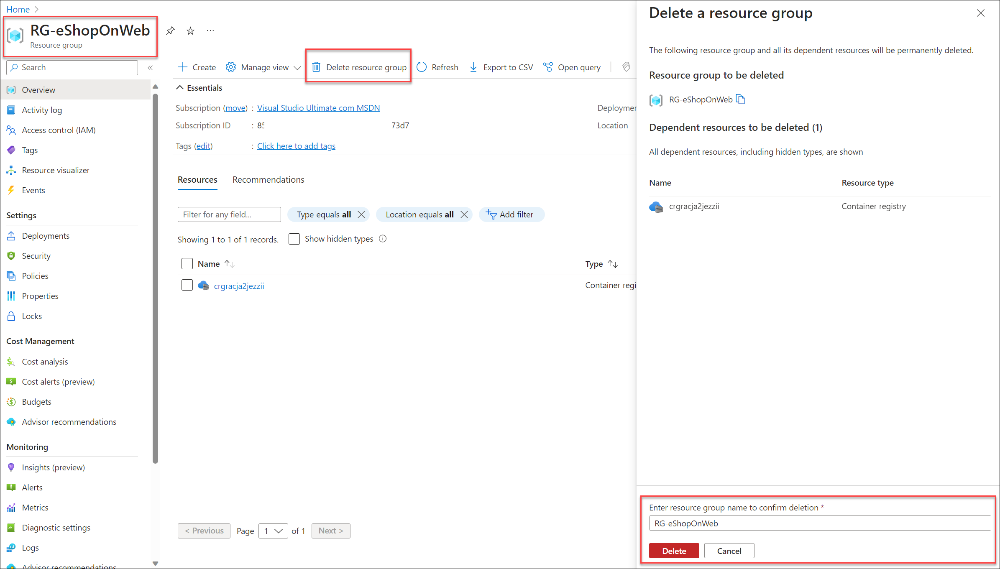

---
lab:
  title: Intégrer Azure Key Vault à Azure Pipelines
  module: 'Module 6: Configure secure access to Azure Repos from pipelines'
---

# Intégrer Azure Key Vault à Azure Pipelines

Azure Key Vault fournit un stockage et une gestion sécurisés des données sensibles telles que les clés, les mots de passe et les certificats. Azure Key Vault inclut la prise en charge des modules de sécurité matériels et une gamme d’algorithmes de chiffrement et de longueurs de clés. Avec Azure Key Vault, vous pouvez réduire le risque de divulgation de données sensibles dans le code source, une erreur courante faite par les développeurs. L’accès à Azure Key Vault nécessite une authentification et une autorisation appropriées, prenant en charge des autorisations précises à son contenu.

Ces exercices prennent environ **40** minutes.

## Avant de commencer

Vous aurez besoin d’un abonnement Azure, d’une organisation Azure DevOps et de l’application eShopOnWeb pour suivre les labos.

- Procédez comme suit pour [valider votre environnement de labo](APL2001_M00_Validate_Lab_Environment.md).

## Instructions

Dans ce labo, vous allez voir comment intégrer Azure Key Vault à Azure Pipelines en effectuant les étapes suivantes :

- Créer un coffre de clés Azure pour stocker un mot de passe ACR en tant que secret
- Créer un principal de service Azure pour accéder aux secrets d’Azure Key Vault
- Configurer des autorisations pour autoriser le principal de service à lire le secret
- Configurer le pipeline pour récupérer le mot de passe à partir d’Azure Key Vault et le transmettre aux tâches suivantes

### Exercice 1 : Configurer le pipeline CI pour créer un conteneur eShopOnWeb

Configurer le pipeline YAML CI pour les opérations suivantes :

- Création d'un Azure Container Registry pour conserver les images des conteneurs
- Utilisation de Docker Compose pour générer et envoyer des images conteneur **eshoppublicapi** et **eshopwebmvc**. Seul le conteneur **eshopwebmvc** sera déployé.

#### Tâche 1 : (à ignorer si vous l’avez déjà effectuée) Créer un principal de service

Dans cette tâche, vous allez créer un principal de service à l’aide d’Azure CLI, ce qui permettra à Azure DevOps d’effectuer les actions suivantes :

- Déployer des ressources sur votre abonnement Azure.
- Disposez d’un accès en lecture sur les secrets Key Vault créés ultérieurement.

Vous aurez besoin d’un principal de service pour déployer des ressources Azure à partir d’Azure Pipelines. Étant donné que vous récupérerez des secrets dans un pipeline, vous devez octroyer l’autorisation au service lorsque nous créons l’Azure Key Vault.

Azure Pipelines crée automatiquement un principal de service lorsque vous vous connectez à un abonnement Azure à partir d’une définition de pipeline ou lorsque vous créez une connexion de service à partir de la page des paramètres du projet (option automatique). Vous pouvez également créer manuellement le principal de service à partir du portail ou utiliser Azure CLI et le réutiliser dans les projets.

1. Démarrez un navigateur web, accédez au Portail Azure sur `https://portal.azure.com` et connectez-vous avec le compte utilisateur qui a le rôle Propriétaire dans l’abonnement Azure que vous utiliserez dans ce labo et qui a le rôle Administrateur global dans le locataire Azure AD associé à cet abonnement.

1. Dans le Portail Azure, cliquez sur l’icône **Cloud Shell** située directement à droite de la zone de texte de recherche en haut de la page.

1. Si vous êtes invité à sélectionner **Bash** ou **PowerShell**, sélectionnez **Bash**.

   > [!NOTE]
   > Si c’est la première fois que vous démarrez **Cloud Shell** et que vous voyez le message **Vous n’avez aucun stockage monté**, sélectionnez l’abonnement que vous utilisez dans ce labo, puis sélectionnez **Créer un stockage**.

1. À partir de l’invite **Bash**, dans le volet **Cloud Shell**, exécutez les commandes suivantes pour récupérer les valeurs de l’ID d’abonnement Azure et des attributs de nom d’abonnement :

    ```bash
    az account show --query id --output tsv
    az account show --query name --output tsv
    ```

    > [!NOTE]
    > Copiez les deux valeurs dans un fichier texte. Vous en aurez besoin plus tard dans ce labo.

1. À partir de l’invite **Bash**, dans le volet **Cloud Shell**, exécutez la commande suivante pour créer un principal de service (remplacez **myServicePrincipalName** par n’importe quelle chaîne unique de caractères composés de lettres et de chiffres) et **mySubscriptionID** par votre Azure subscriptionId :

    ```bash
    az ad sp create-for-rbac --name myServicePrincipalName \
                         --role contributor \
                         --scopes /subscriptions/mySubscriptionID
    ```

    > [!NOTE]
    > La commande va générer une sortie JSON. Copiez la sortie dans un fichier texte. Vous en aurez besoin plus tard dans ce laboratoire.

1. Ensuite accédez au Portail Azure DevOps sur `https://dev.azure.com` et ouvrez votre organisation.

1. Accédez au projet Azure DevOps **eShopOnWeb**. Sélectionnez **Paramètres du projet > Connexions de service (sous Pipelines)** et **Nouvelle connexion de service**.

    

1. Dans le volet **Nouvelle connexion de service**, sélectionnez **Azure Resource Manager**, puis **Suivant** (Il peut être nécessaire de faire défiler l’écran vers le bas).

1. Ensuite, sélectionnez **Principal du service (manuel)** puis sélectionnez **Suivant**.

1. Remplissez les champs vides à l’aide des informations collectées lors des étapes précédentes :
    - ID et nom de l’abonnement.
    - ID du principal de service (ou clientId/AppId), clé du principal de service (ou mot de passe) et TenantId.
    - Dans **Nom de la connexion de service** tapez **azure subs**. Ce nom est référencé dans les pipelines YAML lorsque vous avez besoin d’une connexion de service Azure DevOps pour communiquer avec votre abonnement Azure.

        

1. Ne cochez pas **Accorder une autorisation d’accès à tous les pipelines**. Sélectionnez **Vérifier et enregistrer**.

    > [!NOTE]
    > L’autorisation **Accorder une autorisation d’accès à tous les pipelines** n’est pas recommandée pour les environnements de production. Elle est utilisée uniquement dans ce labo pour simplifier la configuration du pipeline.

#### Tâche 2 : Importer et exécuter un pipeline CI

Dans cette tâche, vous allez importer une définition de pipeline YAML CI existante, la modifier et l’exécuter. Cela va créer un Azure Container Registry (ACR) et générer/publier les images conteneur eShopOnWeb.

1. Accédez au Portail Azure DevOps sur `https://dev.azure.com` et ouvrez votre organisation.

1. Accédez au projet Azure DevOps **eShopOnWeb**. Accédez à **Pipelines > Pipelines**, puis cliquez sur **Créer un pipeline** (ou **Nouveau pipeline**).

1. Dans la fenêtre **Où se trouve votre code ?**, sélectionnez **Azure Repos Git (YAML)** et sélectionnez le **référentiel eShopOnWeb**.

1. Sous la section **Configurer**, choisissez **Fichier YAML Azure Pipelines existant**. Indiquez le chemin d’accès **/.ado/eshoponweb-ci-dockercompose.yml** suivant, puis sélectionnez **Continuer**.

    

1. Dans la définition du pipeline YAML, dans la section des variables, personnalisez le nom de votre groupe de ressources en remplaçant **AZ400-EWebShop-NAME** par le nom de votre préférence, par exemple, **rg-eshoponweb**, remplacez **YOUR-SUBSCRIPTION-ID** par votre propre Azure subscriptionId, puis choisissez l’emplacement de votre préférence la plus proche de votre emplacement, par exemple **southcentralus**.

1. (Facultatif) Vous pouvez utiliser l’agent auto-hébergé créé dans le labo précédent en mettant à jour le nom du pool actuellement défini sur l’agent hébergé par Microsoft vers le nom du pool d’agents que vous avez créé, **eShopOnWebSelfPool**.

    À la place de :

    ```YAML
      - job: Build
        pool:
          vmImage: ubuntu-latest
    
    ```

    Utilisez :

    ```YAML
      - job: Build
        pool: eShopOnWebSelfPool
    
    ```

    > [!NOTE]
    > Pour exécuter le pipeline avec l’agent auto-hébergé, vous devez avoir l’agent en cours d’exécution et tous les prérequis installés, par exemple, Visual Studio pour générer la solution. Si vous n’avez pas installé les prérequis, vous pouvez utiliser l’agent hébergé par Microsoft.

1. Sélectionnez **Enregistrer et exécuter**, choisissez de valider directement dans la branche principale ou créez une branche.

1. Sélectionnez de nouveau **Enregistrer et exécuter**.

    > [!NOTE]
    > Si vous choisissez de créer une branche, vous devez créer une demande de tirage (pull request) pour fusionner les modifications apportées à la branche principale.

1. Ouvrez le pipeline. Si vous voyez le message « Ce pipeline a besoin d’une autorisation pour accéder à une ressource avant que cette exécution puisse poursuivre la création d’ACR pour des images », sélectionnez **Afficher**, **Autoriser** et à nouveau **Autoriser**. Cette opération est nécessaire pour permettre au pipeline de créer la ressource Azure Container Registry (ACR).

    

1. L’exécution du build peut prendre quelques minutes, attendez que le pipeline s’exécute. La définition du build se compose des tâches suivantes :
      - **AzureResourceManagerTemplateDeployment** utilise **bicep** pour déployer un Azure Container Registry.
      - La tâche **PowerShell** prend la sortie bicep (serveur de connexion acr) et crée une variable de pipeline.
      - La tâche **DockerCompose** génère et envoie (push) les images conteneur pour eShopOnWeb vers Azure Container Registry.

1. Votre pipeline choisira un nom en fonction du nom du projet. Renommez-le pour mieux identifier le pipeline.

1. Accédez à **Pipelines > Pipelines** sur le pipeline récemment créé, placez le pointeur de la souris sur le pipeline exécuté, puis sélectionnez les points de suspension et l’option **Renommer/déplacer**.

1. Nommez-le **eshoponweb-ci-dockercompose**, puis sélectionnez **Enregistrer**.

1. Une fois l’exécution terminée, sur le Portail Azure, ouvrez le groupe de ressources précédemment défini et sélectionnez l’entrée représentant l’Azure Container Registry (ACR) déployé par le pipeline.

    > [!NOTE]
    > Pour afficher les référentiels dans le registre, vous devez attribuer un rôle qui fournit un tel accès. Vous utiliserez à cet effet le rôle AcrPull.

1. Sur la page Container Registry, sélectionnez **Contrôle d’accès (IAM)**, sélectionnez **+ Ajouter** et, dans le menu déroulant, sélectionnez **Ajouter une attribution de rôle**.

1. Sous l’onglet **Rôle** de la page **Ajouter une attribution de rôle**, sélectionnez **AcrPull**, puis sélectionnez **Suivant**.

1. Sous l’onglet **Membres**, cliquez sur **+ Sélectionner des membres**, sélectionnez votre compte d’utilisateur, cliquez sur **Sélectionner**, puis sélectionnez **Suivant**.

1. Sélectionnez **Vérifier + attribuer** et, une fois l’affectation effectuée, actualisez la page du navigateur.

1. De retour sur la page Container Registry, dans la barre de menus verticale à gauche, dans la section **Services**, sélectionnez **Référentiels**.

1. Vérifiez que le registre contient les images **eshoppublicapi** et **eshopwebmvc**. Vous utiliserez uniquement **eshopwebmvc** dans la phase de déploiement.

    

1. Sélectionnez **Clés d’accès**, cochez la **Utilisateur administrateur**, puis copiez la valeur du **mot de passe**, qui sera utilisée dans la tâche suivante, car nous la conserverons comme secret dans Azure Key Vault.

    

#### Tâche 3: Créer un Azure Key Vault

Dans cette tâche, vous allez créer un Azure Key Vault à l’aide du Portail Azure.

Pour ce scénario de laboratoire, nous aurons une instance de conteneur Azure (ACI) qui extrait et exécute une image conteneur stockée dans Azure Container Registry (ACR). Nous avons l’intention de stocker le mot de passe de l’ACR en tant que secret dans le coffre de clés.

1. Dans le Portail Azure, dans la zone de texte **Rechercher des ressources, des services et des documents**, tapez **Key Vault**, puis appuyez sur la touche **Entrée**.

1. Dans le volet **Key Vault**, sélectionnez **Créer > Key Vault**.

1. Sous l’onglet **De base** du volet **Créer un coffre de clés**, spécifiez les paramètres suivants, puis cliquez sur **Suivant** :

    | Paramètre | Valeur |
    | --- | --- |
    | Abonnement | le nom de l’abonnement Azure que vous utilisez dans ce labo |
    | Resource group | nom du groupe de ressources **rg-eshoponweb** |
    | Nom du coffre de clés | n’importe quel nom valide unique, comme **ewebshop-kv-NAME** (remplacer NAME) |
    | Région | région Azure proche de l’emplacement de votre environnement de labo |
    | Niveau tarifaire | **Standard** |
    | Jours de conservation des coffres supprimés | **7** |
    | Protection contre le vidage | **Activer la protection contre le vidage** |

1. Sous l’onglet **Configuration d’accès** du volet **Créer un coffre de clés**, dans la section **Modèle d’autorisation**, sélectionnez **Stratégie d’accès au coffre**. 

1. Dans la section **Stratégies d’accès**, sélectionnez **+ Créer** pour configurer une nouvelle stratégie.

    > **Remarque** : vous devez sécuriser l’accès à vos coffres de clés en autorisant uniquement les applications et utilisateurs autorisés. Pour accéder aux données à partir du coffre, vous devez fournir des autorisations de lecture (Obtenir/Répertorier) au principal de service créé précédemment que vous utiliserez pour l’authentification dans le pipeline.

    - Dans le volet **Autorisation**, cochez les autorisations **Obtenir** et **Répertorier** sous **Autorisation secrète**. Cliquez sur **Suivant**.
    - dans le volet **Principal**, recherchez le **principal de service** créé précédemment, à l’aide de l’ID ou du nom donné. Sélectionnez **Suivant** et **Suivant** à nouveau.
    - Sous le volet **Vérifier + créer**, sélectionnez **Créer**

1. De retour dans le volet **Créer un Key Vault**, sélectionnez **Vérifier + Créer > Créer**

    > [!NOTE]
    > Attendez que l’Azure Key Vault soit approvisionné. Cela devrait prendre moins d’une minute.

1. Dans le volet **Votre déploiement a été effectué**, sélectionnez **Accéder à la ressource**.

1. Dans le volet Azure Key Vault, dans le menu vertical situé à gauche du volet, dans la section **Objets**, sélectionnez **Secrets**.

1. Dans le volet **Secrets**, sélectionnez ** Générer/Importer**.

1. Dans le volet **Créer un secret**, spécifiez les paramètres suivants et sélectionnez **Créer** (en laissant les autres avec leurs valeurs par défaut) :

    | Paramètre | Valeur |
    | --- | --- |
    | Options de chargement | **Manuel** |
    | Nom | **acr-secret** |
    | Valeur | Mot de passe d’accès ACR copié dans la tâche précédente |

#### Tâche 3 : Créer un groupe de variables connecté à Azure Key Vault

Dans cette tâche, vous allez créer un groupe de variables dans Azure DevOps qui récupère le secret de mot de passe ACR à partir de Key Vault à l’aide de la connexion de service (Principal de service)

1. Accédez au Portail Azure DevOps sur `https://dev.azure.com` et ouvrez votre organisation.

1. Accédez au projet Azure DevOps **eShopOnWeb**.

1. Dans le volet de navigation vertical du Portail Azure DevOps, sélectionnez **Pipelines > Bibliothèque**. Sélectionnez **+ Groupe de variables**.

1. Dans le volet **Nouveau groupe de variables**, spécifiez les paramètres suivants :

    | Paramètre | Valeur |
    | --- | --- |
    | Nom du groupe de variables | **eshopweb-vg** |
    | Lier des secrets à partir d’Azure KV... | **enable** |
    | Abonnement Azure | **Connexion au service Azure disponible > Azure subs** |
    | Nom du coffre de clés | Nom de votre coffre de clés|

1. Sous **Variables**, sélectionnez **+ Ajouter** et sélectionnez le secret **acr-secret**. Cliquez sur **OK**.

1. Sélectionnez **Enregistrer**.

    

#### Tâche 4 : Configurer le pipeline CD pour déployer un conteneur dans Azure Container Instances (ACI)

Dans cette tâche, vous allez importer un pipeline CD, le personnaliser et l’exécuter pour déployer l’image conteneur créée auparavant dans Azure Container Instances.

1. Accédez au Portail Azure DevOps sur `https://dev.azure.com` et ouvrez votre organisation.

1. Accédez au projet Azure DevOps **eShopOnWeb**. Accédez à **Pipelines > Pipelines** et sélectionnez **Nouveau pipeline**.

1. Dans la fenêtre **Où se trouve votre code ?**, sélectionnez **Azure Repos Git (YAML)** et sélectionnez le **référentiel eShopOnWeb**.

1. Sous la section **Configurer**, choisissez **Fichier YAML Azure Pipelines existant**. Indiquez le chemin d’accès **/.ado/eshoponweb-cd-aci.yml** suivant, puis sélectionnez **Continuer**.

1. Dans la définition du pipeline YAML, personnalisez :

    - **YOUR-SUBSCRIPTION-ID** par votre ID d’abonnement Azure ;
    - **az400eshop-NAME** et remplacer NAME pour le rendre globalement unique.
    - **** YOUR-ACR.azurecr.io et **ACR-USERNAME** par votre serveur de connexion ACR (ils ont tous les deux besoin du nom ACR, que vous pouvez consulter sur ACR > Clés d’accès).
    - **rg-eshoponweb** avec le nom du groupe de ressources défini auparavant dans le labo.

1. Sélectionnez **Enregistrer et exécuter**, puis attendez que le pipeline s’exécute correctement.

    > **Remarque** : le déploiement peut prendre quelques minutes. La définition CD se compose des tâches suivantes :
    - **Ressources** : il est prêt à se déclencher automatiquement en fonction de l’achèvement du pipeline CI. Il télécharge également le référentiel pour le fichier bicep.
    - **Variables (pour la phase de déploiement)** se connecte au groupe de variables pour consommer le secret Azure Key Vault **acr-secret**.
    - **AzureResourceManagerTemplateDeployment** déploie l’Azure Container Instance (ACI) à l’aide du modèle bicep et fournit les paramètres de connexion ACR pour permettre à ACI de télécharger l’image de conteneur créée précédemment à partir d’Azure Container Registry (ACR).

1. Votre pipeline choisira un nom en fonction du nom du projet. Renommez-le pour mieux identifier le pipeline.

1. Accédez à **Pipelines > Pipelines**, sélectionnez le pipeline récemment créé, sélectionnez les points de suspension, puis sélectionnez l’option **Renommer/déplacer**.

1. Nommez-le **eshoponweb-cd-aci**, puis sélectionnez **Enregistrer**.

### Exercice 2 : Supprimer les ressources du labo Azure.

1. Dans le Portail Azure, ouvrez le groupe de ressources créé, puis cliquez sur **Supprimer le groupe de ressources**.

    

    > [!WARNING]
    > N’oubliez pas de supprimer toutes les nouvelles ressources Azure que vous n’utilisez plus. La suppression des ressources inutilisées vous évitera d’encourir des frais inattendus.

## Révision

Dans ce labo, vous avez intégré Azure Key Vault avec un pipeline Azure DevOps en effectuant les étapes suivantes :

- Vous avez créé un principal de service Azure pour fournir l’accès aux secrets d’Azure Key Vault et authentifier le déploiement Azure à partir d’Azure DevOps.
- Vous avez exécuté 2 pipelines YAML importés à partir d’un référentiel Git.
- Vous avez configuré le pipeline pour récupérer le mot de passe à partir d’Azure Key Vault à l’aide du groupe de variables et vous l’avez utilisé dans les tâches suivantes
