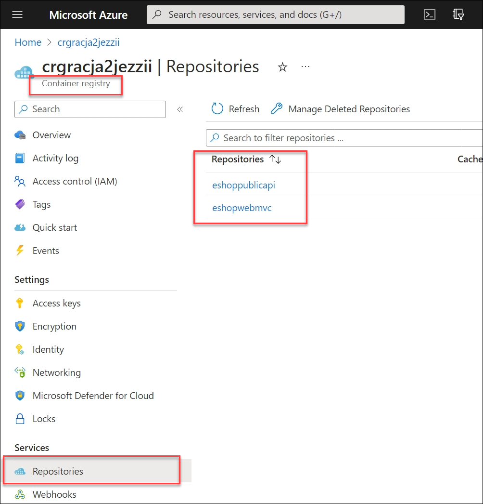
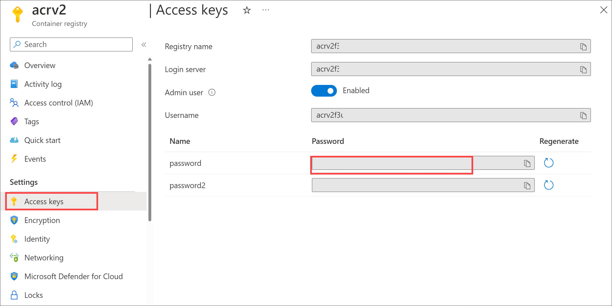
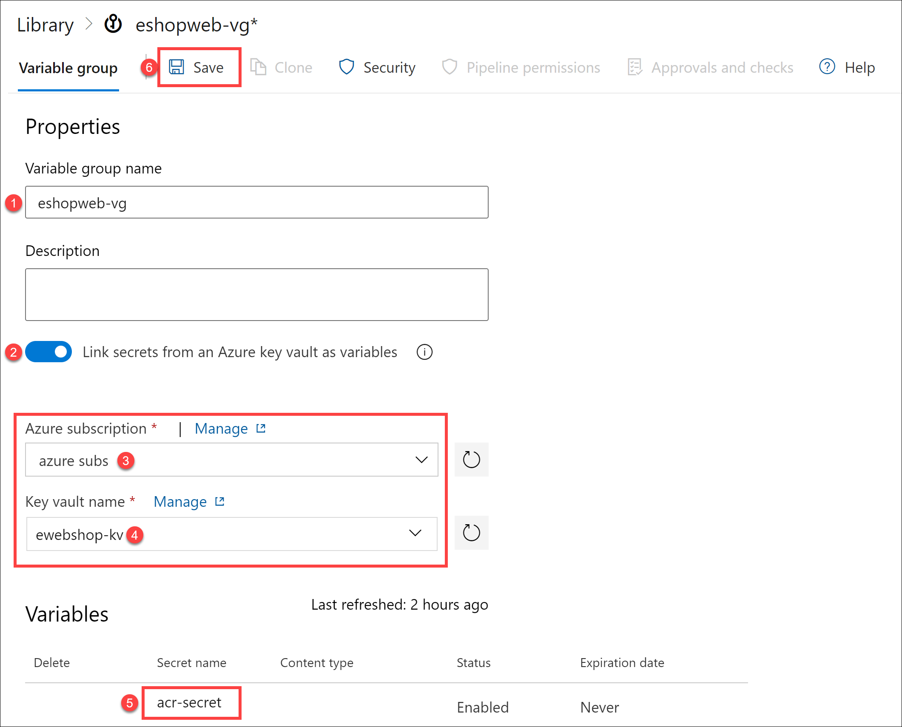

---
lab:
  title: Intégrer Azure Key Vault à Azure Pipelines
  module: 'Module 6: Configure secure access to Azure Repos from pipelines'
---

# Intégrer Azure Key Vault à Azure Pipelines

Azure Key Vault fournit un stockage et une gestion sécurisés des données sensibles telles que les clés, les mots de passe et les certificats. Azure Key Vault inclut la prise en charge des modules de sécurité matériels et une gamme d’algorithmes de chiffrement et de longueurs de clés. Avec Azure Key Vault, vous pouvez réduire le risque de divulgation de données sensibles dans le code source, une erreur courante faite par les développeurs. L’accès à Azure Key Vault nécessite une authentification et une autorisation appropriées, prenant en charge des autorisations précises à son contenu.

Ces exercices prennent environ **40** minutes.

## Avant de commencer

Vous aurez besoin d’un abonnement Azure, d’une organisation Azure DevOps et de l’application eShopOnWeb pour suivre les labos.

- Procédez comme suit pour [valider votre environnement de labo](APL2001_M00_Validate_Lab_Environment.md).

Dans ce labo, vous allez tirer parti du principal de service créé lors de la validation de votre environnement lab pour :

- Déployer des ressources sur un abonnement Azure
- obtenir un accès en lecture aux secrets Azure Key Vault ;

## Instructions

Dans ce labo, vous allez voir comment intégrer Azure Key Vault à Azure Pipelines en effectuant les étapes suivantes :

- Créer un coffre de clés Azure pour stocker un mot de passe ACR en tant que secret
- Configurer des autorisations pour autoriser le principal de service à lire le secret
- configurer le pipeline pour récupérer le mot de passe à partir d’Azure Key Vault et le transmettre aux tâches suivantes.

### Exercice 1 : Configurer le pipeline CI pour créer un conteneur eShopOnWeb

Dans cet exercice, vous allez configurer un pipeline d’intégration continue YAML pour :

- créer un Azure Container Registry pour stocker les images conteneur.
- Utilisation de Docker Compose pour générer et envoyer (push) des images de conteneurs **eshoppublicapi** et **eshopwebmvc** . Seul le conteneur **eshopwebmvc** sera déployé.

#### Tâche 1 : Configurer et exécuter le pipeline d’intégration continue

Dans cette tâche, vous allez importer une définition de pipeline d’intégration continue YAML existante, la modifier et l’exécuter. Le pipeline crée un Azure Container Registry (ACR) et génère/publie les images conteneur eShopOnWeb.

1. Accédez au Portail Azure DevOps sur `https://dev.azure.com` et ouvrez votre organisation.

1. Accédez au projet Azure DevOps **eShopOnWeb**. Accédez à **Pipelines > Pipelines**, puis sélectionnez **Créer un pipeline**.

1. Dans la page **Où se trouve votre code ?**, sélectionnez **Azure Repos Git (YAML)**, puis sélectionnez le référentiel **eShopOnWeb**.

1. Dans la page **Configurer votre pipeline**, sélectionnez **Fichier YAML Azure Pipelines existant**. Indiquez le chemin d’accès **/.ado/eshoponweb-ci-dockercompose.yml** suivant, puis sélectionnez **Continuer**.

   

1. Dans la définition du pipeline YAML, dans la section des variables, effectuez les actions suivantes :

   - remplacez **AZ400-EWebShop-NAME** par **rg-eshoponweb-docker** ;
   - définissez la valeur de la variable d’emplacement sur le nom d’une région Azure que vous avez utilisée dans les labos précédents de ce cours (par exemple **southcentralus**) ;
   - remplacez **YOUR-SUBSCRIPTION-ID** par votre ID d’abonnement Azure ;

1. sélectionnez **Enregistrer et Exécuter**, puis choisissez de valider directement dans la branche primaire.

1. Sélectionnez de nouveau **Enregistrer et exécuter**.

   > [!NOTE]
   > Si vous choisissez de créer une branche, vous devez créer une demande de tirage (pull request) pour fusionner les modifications apportées à la branche principale.

1. Ouvrez le pipeline. Si vous voyez le message « Ce pipeline a besoin d’une autorisation pour accéder à une ressource avant que cette exécution puisse continuer à Docker Compose vers WebApp », sélectionnez **Afficher**, **Autoriser**, puis ** Autoriser **. Cela est nécessaire pour permettre au pipeline de créer les ressources Azure.

   

1. Attendez la fin de l’exécution du pipeline. Cette opération peut prendre quelques minutes. La définition de build est composée des tâches suivantes :

     - **AzureResourceManagerTemplateDeployment** utilise **bicep** pour créer un registre de conteneurs Azure.
     - La tâche **PowerShell** utilise la sortie bicep (serveur de connexion acr) et crée une variable de pipeline.
     - La tâche **DockerCompose** génère et envoie (push) les images conteneur pour eShopOnWeb vers Azure Container Registry.

1. Votre pipeline aura par défaut le nom en fonction du nom du projet. Renommez-le en **eshoponweb-ci-dockercompose** pour mieux identifier le pipeline.

1. Une fois l’exécution du pipeline terminée, utilisez le navigateur web pour accéder au portail Azure, ouvrez le groupe de ressources **rg-eshoponweb-docker**, puis sélectionnez l’entrée représentant Azure Container Registry (ACR) déployée par le pipeline.

   > [!NOTE]
   > Pour afficher les référentiels dans le registre, vous devez accorder à votre compte d’utilisateur un rôle qui fournit un tel accès. Vous utiliserez à cet effet le rôle AcrPull.

1. Sur la page Container Registry, sélectionnez **Contrôle d’accès (IAM)**, sélectionnez **+ Ajouter** et, dans le menu déroulant, sélectionnez **Ajouter une attribution de rôle**.

1. Sous l’onglet **Rôle** de la page **Ajouter une attribution de rôle**, sélectionnez **AcrPull**, puis sélectionnez **Suivant**.

1. Sous l’onglet **Membres**, cliquez sur **+ Sélectionner des membres**, sélectionnez votre compte d’utilisateur, cliquez sur **Sélectionner**, puis sélectionnez **Suivant**.

1. Sélectionnez **Vérifier + attribuer** et, une fois l’affectation effectuée, actualisez la page du navigateur.

1. De retour sur la page Container Registry, dans la barre de menus verticale à gauche, dans la section **Services**, sélectionnez **Référentiels**.

1. Vérifiez que le registre contient les images **eshoppublicapi** et **eshopwebmvc**. Vous utiliserez uniquement **eshopwebmvc** dans la phase de déploiement.

   

1. Sélectionnez **Clés d’accès**, activez la case à cocher **Utilisateur administrateur** et copiez la valeur du **mot de passe**, qui sera utilisée dans la tâche suivante, car vous l’ajouterez comme secret à Azure Key Vault.

   

1. Sur la même page, enregistrez la valeur du **Nom du registre**. Vous en aurez besoin plus tard dans ce labo.

#### Tâche 2 : créer une instance Azure Key Vault

Dans cette tâche, vous allez créer un coffre de clés Azure à l’aide du portail Azure.

Pour ce scénario de labo, nous aurons une instance de conteneur Azure (ACI) qui extrait et exécute une image conteneur stockée dans Azure Container Registry (ACR). Nous avons l’intention de stocker le mot de passe de l’ACR en tant que secret dans le coffre de clés Azure.

1. Dans le Portail Azure, dans la zone de texte **Rechercher des ressources, des services et des documents**, tapez **Key Vault**, puis appuyez sur la touche **Entrée**.

1. Dans le volet **Key Vault**, sélectionnez **Créer > Key Vault**.

1. Sous l’onglet **De base** du volet **Créer un coffre de clés**, spécifiez les paramètres suivants, puis cliquez sur **Suivant** :

   | Paramètre | Valeur |
   | --- | --- |
   | Abonnement | le nom de l’abonnement Azure que vous utilisez dans ce labo |
   | Resource group | nom du groupe de ressources **rg-eshoponweb-docker** |
   | Nom du coffre de clés | tout nom valide unique, comme **ewebshop-kv-** suivi d’un nombre à six chiffres aléatoire |
   | Région | la même région Azure que vous avez choisie précédemment dans ce labo |
   | Niveau tarifaire | **Standard** |
   | Jours de conservation des coffres supprimés | **7** |
   | Protection contre le vidage | **Activer la protection contre le vidage** |

1. Sous l’onglet **Configuration d’accès** du volet **Créer un coffre de clés**, dans la section **Modèle d’autorisation**, sélectionnez **Stratégie d’accès au coffre**. 

1. Dans la section **Stratégies d’accès**, sélectionnez **+ Créer** pour configurer une nouvelle stratégie.

   > **Remarque** : vous devez sécuriser l’accès à vos coffres de clés en autorisant uniquement les applications et utilisateurs autorisés. Pour accéder aux données du coffre, vous devez fournir des autorisations de lecture (Get/List) au principal de service créé précédemment que vous utiliserez pour l’authentification dans le pipeline.

   - Dans le volet **Autorisation**, cochez les autorisations **Obtenir** et **Répertorier** sous **Autorisation secrète**. Cliquez sur **Suivant**.
   - Dans le panneau **Principal**, recherchez le principal de service que vous avez créé lors de la validation de votre environnement lab, soit à l’aide de son ID ou de son nom. Sélectionnez **Suivant** et **Suivant** à nouveau.
   - Sous le volet **Vérifier + créer**, sélectionnez **Créer**

1. De retour dans le volet **Créer un Key Vault**, sélectionnez **Vérifier + Créer > Créer**

   > [!NOTE]
   > Attendez que l’Azure Key Vault soit approvisionné. Cela devrait prendre moins d’une minute.

1. Dans le volet **Votre déploiement a été effectué**, sélectionnez **Accéder à la ressource**.

1. Dans le volet Azure Key Vault, dans le menu vertical situé à gauche du volet, dans la section **Objets**, sélectionnez **Secrets**.

1. Dans le volet **Secrets**, sélectionnez ** Générer/Importer**.

1. Dans le volet **Créer un secret**, spécifiez les paramètres suivants et sélectionnez **Créer** (en laissant les autres avec leurs valeurs par défaut) :

   | Paramètre | Valeur |
   | --- | --- |
   | Options de chargement | **Manuel** |
   | Nom | **acr-secret** |
   | Valeur | Mot de passe d’accès ACR copié dans la tâche précédente |

#### Tâche 3 : créer un groupe de variables connecté à Azure Key Vault

Dans cette tâche, vous allez créer un groupe de variables dans Azure DevOps qui récupère le secret de mot de passe ACR à partir de Key Vault à l’aide de la connexion de service (Principal de service)

1. Accédez au Portail Azure DevOps sur `https://dev.azure.com` et ouvrez votre organisation.

1. Accédez au projet Azure DevOps **eShopOnWeb**.

1. Dans le volet de navigation vertical du Portail Azure DevOps, sélectionnez **Pipelines > Bibliothèque**. Sélectionnez **+ Groupe de variables**.

1. Dans le volet **Nouveau groupe de variables**, spécifiez les paramètres suivants :

   | Paramètre | Valeur |
   | --- | --- |
   | Nom du groupe de variables | **eshopweb-vg** |
   | Lier les secrets d’Azure Key Vault en tant que variables | **enable** |
   | Abonnement Azure | **Connexion de service Azure disponible > Sous-réseaux Azure** |
   | Nom du coffre de clés | le nom que vous avez attribué au coffre de clés Azure dans la tâche précédente |

1. Sous **Variables**, sélectionnez **+ Ajouter** et sélectionnez le secret **acr-secret**. Cliquez sur **OK**.

1. Sélectionnez **Enregistrer**.

   

#### Tâche 4 : Configurer le pipeline CD pour déployer un conteneur dans Azure Container Instances (ACI)

Dans cette tâche, vous allez importer un pipeline de déploiement continu, le personnaliser et l’exécuter pour déployer l’image conteneur créée avant dans une instance de conteneur Azure.

1. Dans le portail Azure DevOps affichant le projet **eShopOnWeb**, sélectionnez **Pipelines > Pipelines**, puis sélectionnez **Nouveau pipeline**.

1. Dans la page **Où se trouve votre code ?**, sélectionnez **Azure Repos Git (YAML)**, puis sélectionnez le référentiel **eShopOnWeb**.

1. Dans la page **Configurer votre pipeline**, sélectionnez **Fichier YAML Azure Pipelines existant**. Indiquez le chemin **/.ado/eshoponweb-cd-aci.yml**, puis sélectionnez **Continuer**.

1. Dans la définition du pipeline YAML, dans la section des variables, effectuez les actions suivantes :

   - définissez la valeur de la variable d’emplacement sur le nom d’une région Azure que vous avez utilisée précédemment dans ce labo ;
   - remplacez **YOUR-SUBSCRIPTION-ID** par votre ID d’abonnement Azure ;
   - remplacez **az400eshop-NAME** par un nom global unique de l’instance de conteneur Azure à déployer, par exemple, la chaîne **eshoponweb-lab-docker-** suivie d’un nombre à six chiffres aléatoire ; 
   - remplacez **YOUR-ACR** et **ACR-USERNAME** par le nom de votre registre ACR que vous avez enregistré précédemment dans ce labo ;
   - remplacez **AZ400-EWebShop-NAME** par le nom du groupe de ressources que vous avez créé précédemment dans ce labo (**rg-eshoponweb-docker**).

1. Sélectionnez **Enregistrer et Exécuter**, puis sélectionnez **Enregistrer et Réexécuter**.

1. Ouvrez le pipeline et notez le message « Ce pipeline a besoin d’une autorisation pour accéder à deux ressources avant que cette exécution puisse continuer à Docker Compose vers ACI ». Sélectionnez **Affichage**, puis **Autoriser** deux fois (une fois pour chaque ressource) pour autoriser l’exécution du pipeline.

1. Attendez la fin de l’exécution du pipeline. Cette opération peut prendre quelques minutes. La définition de build se compose d’une tâche unique **AzureResourceManagerTemplateDeployment**, qui déploie l’instance de conteneur Azure (ACI) à l’aide d’un modèle bicep et fournit les paramètres de connexion ACR pour permettre à l’ACI de télécharger l’image conteneur créée précédemment.

1. Votre pipeline est nommé en fonction du nom du projet. Renommez-le pour **eshoponweb-cd-aci** afin d’identifier plus facilement son objectif.

### Exercice 2 : Effectuerle nettoyage des ressources Azure et Azure DevOps

Dans cet exercice, vous allez supprimer les ressources Azure et Azure DevOps créées dans ce labo.

#### Tâche 1 : Supprimer les ressources Azure

1. Dans le portail Azure, accédez au groupe de ressources **rg-eshoponweb-docker** contenant des ressources déployées et sélectionnez **Supprimer le groupe de ressources** pour supprimer toutes les ressources créées dans ce labo.

#### Tâche 2 : Supprimer les pipelines Azure DevOps

1. Accédez au Portail Azure DevOps sur `https://dev.azure.com` et ouvrez votre organisation.

1. Ouvrez le projet **eShopOnWeb**.

1. Accédez à **Pipelines > Pipelines**.

1. Accédez à **Pipelines > Pipelines** et supprimez les pipelines existants.

#### Tâche 3 : Recréer le référentiel Azure DevOps

1. Dans le portail Azure DevOps, dans le projet **eShopOnWeb**, sélectionnez **Paramètres du projet** dans le coin inférieur gauche.

1. Dans le menu vertical **Paramètres du projet** sur le côté gauche, dans la section **Référentiels**, sélectionnez **Référentiels**.

1. Dans le volet **Tous les référentiels**, pointez sur l’extrémité droite de l’entrée de référentiel **eShopOnWeb** jusqu’à ce que l’icône **Plus d’options** s’affiche, sélectionnez-la et, dans le menu **Plus d’options**, sélectionnez **Renommer**.  

1. Dans la fenêtre **Renommer le référentiel eShopOnWeb**, dans la zone de texte **Nom du référentiel**, entrez **eShopOnWeb_old**, puis sélectionnez**Renommer**.

1. Dans le volet **Tous les référentiels**, sélectionnez **+ Créer**.

1. Dans le volet **Créer un référentiel**, dans la zone de texte **Nom du référentiel**, entrez **eShopOnWeb**, décochez la case **Ajouter un fichier README**, puis sélectionnez **Créer**.

1. De retour dans le volet **Tous les référentiels**, pointez sur l’extrémité droite de l’entrée de référentiel **eShopOnWeb_old** jusqu’à ce que l’icône **Plus d’options** s’affiche, sélectionnez-la et, dans le menu **Plus d’options**, sélectionnez **Supprimer**.  

1. Dans la fenêtre **Supprimer le référentiel eShopOnWeb_old**, entrez **eShopOnWeb_old**, puis sélectionnez **Supprimer**.

1. Dans le menu de navigation de gauche du portail Azure DevOps, sélectionnez **Référentiels**.

1. Dans le volet **eShopOnWeb est vide. Ajouter du code !**, sélectionnez **Importer un référentiel**.

1. Dans la fenêtre **Importer un référentiel Git**, collez l’URL `https://github.com/MicrosoftLearning/eShopOnWeb` suivante, puis sélectionnez **Importer** :

## Révision

Dans ce labo, vous avez intégré Azure Key Vault à un pipeline Azure DevOps en effectuant les étapes suivantes :

- Utilisé un principal de service Azure pour fournir l’accès aux secrets du coffre de clés Azure et pour fournir l’accès aux ressources Azure à partir d’Azure DevOps.
- Vous avez exécuté deux pipelines YAML importés à partir d’un référentiel Git.
- Pipeline configuré pour récupérer le mot de passe du coffre de clés Azure à l’aide d’un groupe de variables et le réutiliser lors des tâches suivantes.
