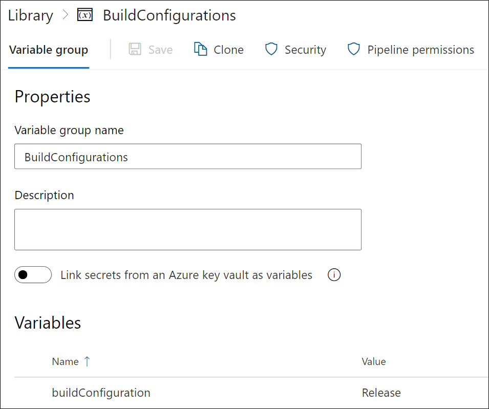
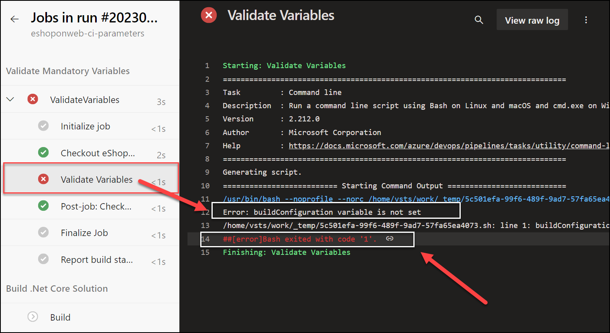

---
lab:
  title: Configurer des pipelines pour utiliser de manière sécurisée des variables et des paramètres
  module: 'Module 7: Configure pipelines to securely use variables and parameters'
---

# Configurer des pipelines pour utiliser de manière sécurisée des variables et des paramètres

Dans ce labo, vous allez découvrir comment configurer des pipelines pour utiliser de manière sécurisée des variables et des paramètres.

Ces exercices prennent environ **20** minutes.

## Avant de commencer

Vous aurez besoin d’un abonnement Azure, d’une organisation Azure DevOps et de l’application eShopOnWeb pour suivre les labos.

- Procédez comme suit pour [valider votre environnement de labo](APL2001_M00_Validate_Lab_Environment.md).

## Instructions

### Exercice 1 : Vérifier les types de paramètres et variables

#### Tâche 1 : Importer et exécuter le pipeline CI

Commencez par importer le pipeline CI nommé [eshoponweb-ci.yml](https://github.com/MicrosoftLearning/eShopOnWeb/blob/main/.ado/eshoponweb-ci.yml).

1. Accédez au Portail Azure DevOps sur `https://dev.azure.com` et ouvrez votre organisation.

1. Ouvrez le projet eShopOnWeb.

1. Accédez à **Pipelines > Pipelines**.

1. Sélectionnez **Créer un pipeline**.

1. Sélectionnez **Azure Repos Git (YAML)**.

1. Sélectionnez le référentiel **eShopOnWeb**.

1. Sélectionnez **Fichier YAML Azure Pipelines existant**.

1. Sélectionnez le fichier **/.ado/eshoponweb-ci.yml**, puis **Continuer**.

1. Sélectionnez le bouton **Exécuter** pour exécuter le pipeline.

   > [!NOTE]
   > Votre pipeline choisira un nom en fonction du nom du projet. Renommez-le pour mieux identifier le pipeline.

1. Accédez à **Pipelines > Pipelines** et sélectionnez le pipeline récemment créé. Sélectionnez les points de suspension puis l’option **Renommer/déplacer**.

1. Nommez-le **eshoponweb-ci-parameters**, puis sélectionnez **Enregistrer**.

#### Tâche 2 : Vérifier les types de paramètre pour les pipelines YAML

Dans cette tâche, vous allez définir des types de paramètre et des paramètres pour le pipeline.

1. Accédez à **Pipelines > Pipelines** et sélectionnez le pipeline **eshoponweb-ci-parameters**.

1. Sélectionnez **Modifier**.

1. Ajoutez les sections de paramètres et de ressources suivantes en haut du fichier YAML :

   ```yaml
   parameters:
   - name: dotNetProjects
     type: string
     default: '**/*.sln'
   - name: testProjects
     type: string
     default: 'tests/UnitTests/*.csproj'

   resources:
     repositories:
     - repository: self
       trigger: none

   ```

1. Remplacez les chemins codés en dur dans les tâches `Restore`, `Build` et `Test` avec les paramètres que vous venez de créer.

   - **Remplacez les projets** : `**/*.sln` par des projets : `${{ "{{" }} parameters.dotNetProjects }}` dans les tâches `Restore` et `Build`.
   - **Remplacez les projets** : `tests/UnitTests/*.csproj` par des projets : `${{ "{{" }} parametertestProjects }}` dans la tâche `Test`

    Les tâches `Restore`, `Build` et `Test` de la section des étapes du fichier YAML doivent ressembler à ceci :

    

    ```yaml
    steps:
    - task: DotNetCoreCLI@2
      displayName: Restore
      inputs:
        command: 'restore'
        projects: ${{ parameters.dotNetProjects }}
        feedsToUse: 'select'
    
    - task: DotNetCoreCLI@2
      displayName: Build
      inputs:
        command: 'build'
        projects: ${{ parameters.dotNetProjects }}
    
    - task: DotNetCoreCLI@2
      displayName: Test
      inputs:
        command: 'test'
        projects: ${{ parameters.testProjects }}
    
    ```

    

1. Enregistrez et exécutez le pipeline. Vérifiez que l’exécution du pipeline se termine avec succès.

   

#### Tâche 3 : Sécurisation des variables et des paramètres

Dans cette tâche, vous allez sécuriser les variables et les paramètres de votre pipeline à l’aide de groupes de variables.

1. Accédez à **Pipelines > Bibliothèque**.

1. Sélectionnez le bouton **+ Groupe de variables** pour créer un groupe de variables nommé **BuildConfigurations**.

1. Ajoutez une variable nommée **buildConfiguration** et définissez sa valeur sur `Release`sur .

1. Enregistrez le groupe de variables.

   

1. Sélectionnez le bouton **Autorisations de pipeline**, puis sélectionnez le bouton **+** pour ajouter un nouveau pipeline.

1. Sélectionnez le pipeline **eshoponweb-ci-parameters** pour permettre au pipeline d’utiliser le groupe de variables.

   

   > [!NOTE]
   > Vous pouvez également définir des utilisateurs ou des groupes spécifiques pour pouvoir modifier le groupe de variables en cliquant sur le bouton **Sécurité**.

1. Accédez à **Pipelines > Pipelines**.

1. Ouvrez le pipeline **eshoponweb-ci-parameters**, puis sélectionnez **Modifier**.

1. En haut du fichier yaml, juste sous les paramètres, référencez le groupe de variables en ajoutant ce qui suit :

   ```yaml
   variables:
     - group: BuildConfigurations
   ```

1. Dans la tâche « Générer », remplacez la commande : 'build’ par les lignes suivantes pour utiliser la configuration de build à partir du groupe de variables.

    

    ```yaml
            command: 'build'
            projects: ${{ parameters.dotNetProjects }}
            configuration: $(buildConfiguration)
    ```

    

1. Enregistrez et exécutez le pipeline. Il doit s’exécuter correctement avec la configuration de build définie sur `Release`. Vous pouvez le vérifier en examinant les journaux de la tâche « Générer ».

> [!NOTE]
> En suivant cette approche, vous pouvez sécuriser vos variables et paramètres en utilisant des groupes de variables sans avoir à les coder en dur dans les fichiers YAML.

#### Tâche 4 : Validation des variables et paramètres obligatoires

Dans cette tâche, vous allez valider les variables obligatoires avant l’exécution du pipeline.

1. Accédez à **Pipelines > Pipelines**.

1. Ouvrez le pipeline **eshoponweb-ci-parameters**, puis sélectionnez **Modifier**.

1. Dans la section des étapes, au début (en suivant la ligne `stage:`), ajoutez une nouvelle étape nommée **Valider** pour valider les variables obligatoires avant l’exécution du pipeline.

    ```yaml
    - stage: Validate
      displayName: Validate mandatory variables
      jobs:
      - job: ValidateVariables
        pool:
          vmImage: ubuntu-latest
        steps:
        - script: |
            if [ -z "$(buildConfiguration)" ]; then
              echo "Error: buildConfiguration variable is not set"
              exit 1
            fi
          displayName: 'Validate Variables'
     ```

    > [!NOTE]
    > Cette étape exécute un script pour valider la variable buildConfiguration. Si les variables ne sont pas définies, le script échouera et le pipeline s’arrêtera.

1. Faites en sorte que l’étape **Génération** dépende de l’étape **Valider** en ajoutant `dependsOn: Validate` au début de l’étape **Génération** :

    ```yaml
    - stage: Build
      displayName: Build .Net Core Solution
      dependsOn: Validate
    ```

1. Enregistrez et exécutez le pipeline. Il s’exécute correctement, car la variable buildConfiguration est définie dans le groupe de variables.

1. Pour tester la validation, supprimez la variable buildConfiguration du groupe de variables ou supprimez le groupe de variables, puis réexécutez le pipeline. Il doit échouer avec l’erreur suivante :

    ```yaml
    Error: buildConfiguration variable is not set   
    ```

    

1. Ajoutez le groupe de variables et la variable buildConfiguration au groupe de variables et réexécutez le pipeline. Cette opération doit s’exécuter avec succès.

## Révision

Dans ce labo, vous avez appris comment configurer des pipelines pour utiliser de manière sécurisée des variables et des paramètres.
