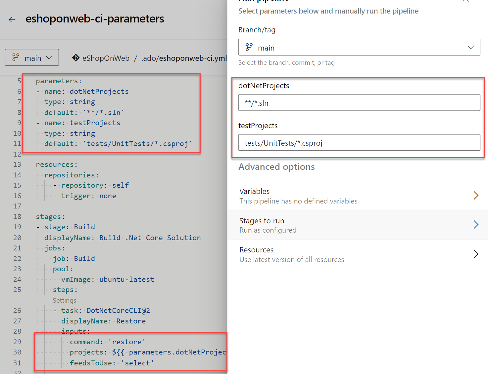

---
lab:
  title: Configurer des pipelines pour utiliser de manière sécurisée des variables et des paramètres
  module: 'Module 7: Configure pipelines to securely use variables and parameters'
---

# Configurer des pipelines pour utiliser de manière sécurisée des variables et des paramètres

Dans ce labo, vous allez découvrir comment configurer des pipelines pour utiliser de manière sécurisée des variables et des paramètres.

Ces exercices prennent environ **20** minutes.

## Avant de commencer

Vous aurez besoin d’un abonnement Azure, d’une organisation Azure DevOps et de l’application eShopOnWeb pour suivre les labos.

- Procédez comme suit pour [valider votre environnement de labo](APL2001_M00_Validate_Lab_Environment.md).

## Instructions

### Exercice 1 : Vérifier les types de paramètres et variables

#### Tâche 1 : (ignorer si déjà effectuée) importer et exécuter le pipeline CI

Commençons par importer le pipeline CI nommé [eshoponweb-ci.yml](https://github.com/MicrosoftLearning/eShopOnWeb/blob/main/.ado/eshoponweb-ci.yml).

1. Accédez au Portail Azure DevOps sur `https://aex.dev.azure.com` et ouvrez votre organisation.

1. Ouvrez le projet **eShopOnWeb** dans Azure DevOps.

1. Accédez à **Pipelines > Pipelines**.

1. Sélectionnez le bouton **Créer un pipeline**.

1. Sélectionnez **Azure Repos Git (Yaml)**.

1. Sélectionnez le référentiel **eShopOnWeb**.

1. Sélectionnez **Fichier YAML Azure Pipelines existant**.

1. Sélectionnez le fichier **/.ado/eshoponweb-ci.yml**, puis cliquez sur **Continuer**.

1. Sélectionnez le bouton **Exécuter** pour exécuter le pipeline.

   > **Remarque** : votre pipeline est nommé en fonction du nom du projet. Vous le renommez pour identifier plus facilement le pipeline.

1. Accédez à **Pipelines > Pipelines** et sélectionnez le pipeline récemment créé. Sélectionnez les points de suspension puis **Renommer/déplacer**.

1. Nommez-le **eshoponweb-ci**, puis sélectionnez **Enregistrer**.

#### Tâche 2 : Vérifier les types de paramètre pour les pipelines YAML

Dans cette tâche, vous allez définir des types de paramètre et des paramètres pour le pipeline.

1. Accédez à **Pipelines > Pipelines** et sélectionnez le pipeline **eshoponweb-ci**.

1. Sélectionnez **Modifier**.

1. Ajoutez les paramètres suivants figurant au-dessus des sections des travaux en haut du fichier YAML :

   ```yaml
   parameters:
   - name: dotNetProjects
     type: string
     default: '**/*.sln'
   - name: testProjects
     type: string
     default: 'tests/UnitTests/*.csproj'

   jobs:
   - job: Build
     pool: eShopOnWebSelfPool
     steps:

   ```

1. Remplacez les chemins d’accès codés en dur dans les tâches « Restaurer », « Générer » et « Tester » par les paramètres que vous venez de créer.

   - **Remplacez les projets** : `**/*.sln` par des projets : `${{ parameters.dotNetProjects }}` dans les tâches `Restore` et `Build`.
   - **Remplacez les projets** : `tests/UnitTests/*.csproj` par des projets : `${{ parameters.testProjects }}` dans la tâche `Test`

   Les tâches « Restaurer », « Générer » et « Tester » de la section des étapes du fichier YAML doivent ressembler à ceci :

    ```yaml
    steps:
    - task: DotNetCoreCLI@2
      displayName: Restore
      inputs:
        command: 'restore'
        projects: ${{ parameters.dotNetProjects }}
        feedsToUse: 'select'
    
    - task: DotNetCoreCLI@2
      displayName: Build
      inputs:
        command: 'build'
        projects: ${{ parameters.dotNetProjects }}
    
    - task: DotNetCoreCLI@2
      displayName: Test
      inputs:
        command: 'test'
        projects: ${{ parameters.testProjects }}
    
    ```

1. Cliquez sur **Valider et enregistrer** pour enregistrer les modifications, puis cliquez sur **Enregistrer**.

1. Accédez à **Pipelines > Pipelines** et ouvrez le pipeline **eshoponweb-ci** en qui se déclenche automatiquement.

1. Vérifiez que l’exécution du pipeline se termine avec succès.

   

#### Tâche 3 : Sécurisation des variables et des paramètres

Dans cette tâche, vous allez sécuriser les variables et les paramètres de votre pipeline à l’aide de groupes de variables.

1. Accédez à **Pipelines > Bibliothèque**.

1. Sélectionnez le bouton **+ Groupe de variables** pour créer un groupe de variables nommé `BuildConfigurations`.

1. Ajoutez une variable nommée `buildConfiguration` et définissez sa valeur sur `Release`.

1. Enregistrez le groupe de variables.

   

1. Sélectionnez le bouton **Autorisations de pipeline**, puis sélectionnez le bouton **+** pour ajouter un nouveau pipeline.

1. Sélectionnez le pipeline **eshoponweb-ci** pour permettre au pipeline d’utiliser le groupe de variables.

   

   > **Remarque** : vous pouvez également définir des utilisateurs ou des groupes spécifiques pour pouvoir modifier le groupe de variables en cliquant sur le bouton **Sécurité**.

1. Accédez à **Pipelines > Pipelines**.

1. Ouvrez le pipeline **eshoponweb-ci-**, puis sélectionnez **Modifier**.

1. En haut du fichier yaml, juste sous les paramètres, référencez le groupe de variables en ajoutant ce qui suit :

   ```yaml
   variables:
     - group: BuildConfigurations
   ```

1. Dans la tâche « Générer », ajoutez le paramètre de configuration à la tâche pour utiliser la configuration de build à partir du groupe de variables.

    ```yaml
            command: 'build'
            projects: ${{ parameters.dotNetProjects }}
            configuration: $(buildConfiguration)
    ```

1. Cliquez sur **Valider et enregistrer** pour enregistrer les modifications, puis cliquez sur **Enregistrer**.

1. Ouvrez l’exécution de pipeline **eshoponweb-ci**. Il doit s’exécuter correctement avec la configuration de build définie sur « Lancement ». Vous pouvez le vérifier en examinant les journaux de la tâche « Générer ».

> **Remarque** : si vous ne voyez pas la configuration de build définie sur « Lancement » dans les journaux, activez les diagnostics du système et réexécutez le pipeline pour afficher la valeur de configuration.

> **Remarque** : sn suivant cette approche, vous pouvez sécuriser vos variables et paramètres en utilisant des groupes de variables sans avoir à les coder en dur dans les fichiers YAML.

#### Tâche 4 : Validation des variables et paramètres obligatoires

Dans cette tâche, vous allez valider les variables obligatoires avant l’exécution du pipeline.

1. Accédez à **Pipelines > Pipelines**.

1. Ouvrez le pipeline **eshoponweb-ci-**, puis sélectionnez **Modifier**.

1. Dans la section des étapes, au début (en suivant la ligne **steps**), ajoutez une nouvelle tâche de script pour valider les variables obligatoires avant l’exécution du pipeline.

    ```yaml
    - script: |
        IF NOT DEFINED buildConfiguration (
          ECHO Error: buildConfiguration variable is not set
          EXIT /B 1
        )
      displayName: 'Validate Variables'
     ```

    > **Remarque** : il s’agit d’une validation simple pour vérifier si la variable est définie. Si les variables ne sont pas définies, le script échouera et le pipeline s’arrêtera. Vous pouvez ajouter une validation plus complexe pour vérifier la valeur de la variable ou si elle est définie sur une valeur spécifique.

1. Cliquez sur **Valider et enregistrer** pour enregistrer les modifications, puis cliquez sur **Enregistrer**.

1. Ouvrez l’exécution de pipeline **eshoponweb-ci**. Il s’exécute correctement, car la variable buildConfiguration est définie dans le groupe de variables.

1. Pour tester la validation, supprimez la variable buildConfiguration du groupe de variables ou renommez la variable, puis réexécutez le pipeline. Il doit échouer avec l’erreur suivante :

    ```yaml
    Error: buildConfiguration variable is not set   
    ```

    

1. Ajoutez la variable buildConfiguration au groupe de variables et réexécutez le pipeline. Cette opération doit s’exécuter avec succès.

> [!IMPORTANT]
> N’oubliez pas de supprimer les ressources créées dans le portail Azure pour éviter les frais inutiles.

## Révision

Dans ce labo, vous avez appris comment configurer des pipelines pour utiliser de manière sécurisée des variables et des paramètres.
